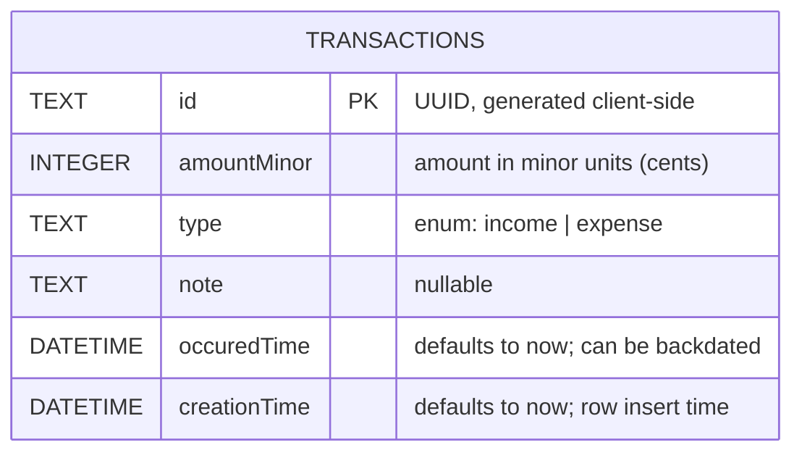

# StockFlow

A Flutter application for tracking transactions, built with the BLoC pattern
and a local [Drift](https://drift.simonbinder.eu/) (SQLite) database.

## Getting Started

```bash
flutter pub get
dart run build_runner build --delete-conflicting-outputs
flutter run
```

The `build_runner` step regenerates `*.g.dart` files whenever a Drift table
definition changes — run it again after editing anything under
`lib/transactions/data/models/`.

## Architecture

The `transactions` feature is organized feature-first:

```
lib/transactions/
├── bloc/                       # TransactionsBloc, events, states
├── data/
│   ├── models/
│   │   └── transactions.dart   # Drift table definition
│   ├── repos/
│   │   └── fake_repository.dart # In-memory stand-in used during BLoC scaffolding
│   ├── transactions_data_source.dart    # Drift database class (real persistence)
│   └── transactions_data_source.g.dart  # Generated by drift_dev — do not edit
└── presentation/                # UI (not yet built)
```

`TransactionsBloc` currently talks to `FakeRepository`, an in-memory
`List<String>` used to validate the event/state wiring before the real data
layer existed. `TransactionsDataSource` is the real Drift-backed
implementation; wiring the bloc to it is the next step.

## Database schema



### Design decisions

- **`id` is a client-generated UUID (`TEXT`), not an autoincrement integer.**
  Autoincrement IDs only exist after a row commits, which blocks
  optimistic-UI inserts and can collide once multiple devices insert data
  offline and later sync. A UUID can be generated before the insert and stays
  unique across devices with no coordination. Trade-off: slightly larger
  storage per row than an integer key — acceptable for a local, low-volume
  ledger table.
- **`amountMinor` is an `INTEGER` (minor units, e.g. cents), not a `double`.**
  Floating-point can't represent most decimal fractions exactly
  (`0.1 + 0.2 != 0.3` in IEEE 754), so summing amounts as `double` drifts over
  time. Storing whole minor units keeps every arithmetic operation exact;
  conversion to a display string (`$3.50`) happens only at the UI boundary.
- **`type` is a Drift `textEnum<TransactionType>`, not a bare `TEXT` column.**
  The set of valid values is fixed and known (`income`, `expense`), so the
  column is typed to match — the compiler catches typos and invalid values at
  the call site instead of letting malformed strings reach the database.
- **`note` is nullable; `occuredTime`/`creationTime` are not.**
  A transaction doesn't always have a note, so the column allows `NULL`.
  Both timestamps default to "now" via `withDefault(currentDateAndTime)`, but
  `occuredTime` can be overridden on insert to log a backdated transaction,
  while `creationTime` is meant to always reflect actual insert time.

## What's implemented so far

- ✅ `TransactionsBloc` with `AppLaunchEvent` / `AddTransactionEvent` /
  `DeleteTransactionEvent` and `Initial` / `Loading` / `Loaded` / `Error`
  states (the `Loading`/`Error` states retain the previous list so the UI
  doesn't blank out mid-operation).
- ✅ Drift schema for `Transactions` (see above).
- ✅ `TransactionsDataSource` with `allTransactions`, `addTransaction`,
  `deleteTransaction`, backed by real SQLite via `sqlite3_flutter_libs`.
- ✅ Unit tests (`test/database_test.dart`) covering inserts, defaults,
  backdating, enum round-tripping, duplicate-id rejection, deletes, and
  empty/multi-row reads — run against an in-memory database
  (`NativeDatabase.memory()`), so no state leaks between tests and nothing
  touches disk.

## Not yet done

- The bloc still talks to `FakeRepository`; swapping it to
  `TransactionsDataSource` is the next step.
- No UI is wired up yet (`presentation/` is a placeholder).
- No repository abstraction/interface sits between the bloc and the data
  source yet — planned once the real repository replaces the fake one.

## Running tests

```bash
flutter test
```
