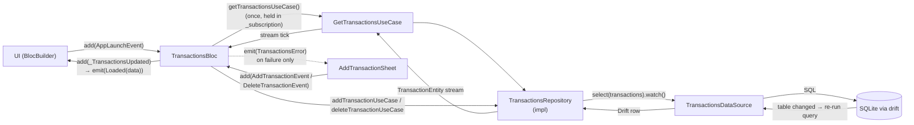
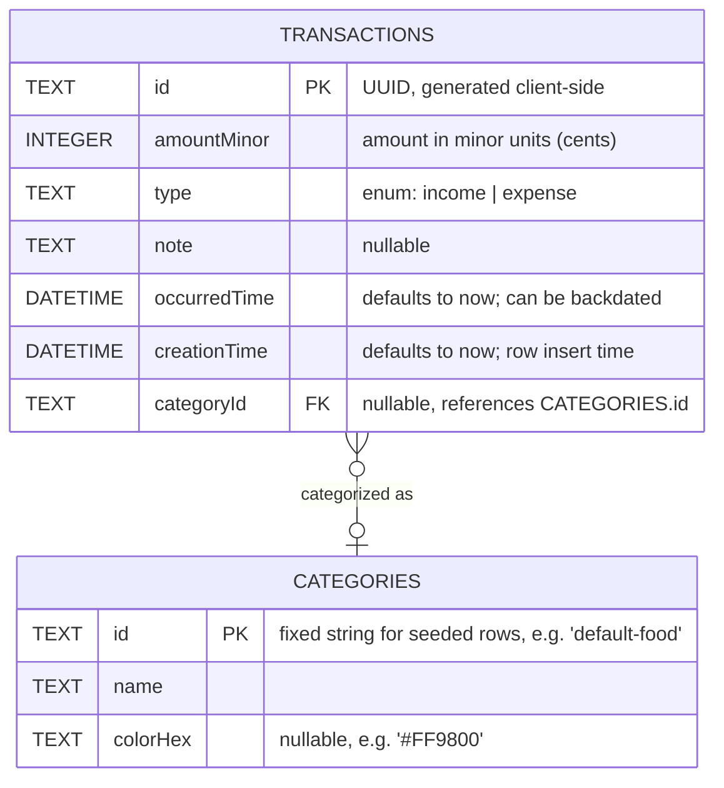

# Money Log

<p align="center">
  
  &nbsp;&nbsp;
  
  &nbsp;&nbsp;
  
  &nbsp;&nbsp;
  
</p>

<p align="center">
  <em>Balance summary &amp; transaction list &nbsp;·&nbsp; Add-transaction sheet &nbsp;·&nbsp; Category picker &nbsp;·&nbsp; Empty state</em>
</p>

<p align="center">
  
  
  
  
  
  <a href="LICENSE"></a>
</p>

<p align="center">
  <a href="https://github.com/Israa050/money-log/releases/latest">
    
  </a>
</p>

<p align="center">
  <a href="https://claude.ai/code/artifact/7ef70167-84d3-4ec5-b1da-6acea789d354">📊 The Reactive Loop — interactive diagram</a>
  &nbsp;·&nbsp;
  <a href="https://claude.ai/code/artifact/97b41c14-86fe-47d7-bbc0-a13aed14b7d2">🖱️ Live transactions demo</a>
</p>

---

## 📖 About

Money Log is a small, focused personal-finance tracker: log income and
expenses, see your balance update instantly, and undo a delete before it's
final. It exists as a reference implementation of a **fully reactive**
Flutter architecture — every screen is driven by a live database stream, not
a fetch-then-render cycle, so the UI is never more than one SQLite write away
from the truth.

The app is built with the **BLoC** pattern on top of
**[Drift](https://drift.simonbinder.eu/)** (a type-safe SQLite layer): a
write lands in the database, Drift's `.watch()` query notices the table
changed, and the new data arrives back at the screen on its own — no manual
refresh, no re-fetch after a mutation, no stale state to reconcile. The UI
itself uses a warm, editorial dark-first design system with distinct
income/expense color language, card-based transaction rows, and swipe-to-
delete with a countdown undo.

## ✨ Features

- 📊 **Balance summary** — live total balance with income/expense breakdown
- 📋 **Transaction list** — card-styled rows with type icon, note, date, and amount
- ➕ **Add transactions** — bottom sheet with an income/expense toggle, amount, optional note, and optional category
- 🏷️ **Categories** — pick from four seeded default categories (Food, Transport, Shopping, Bills) when adding a transaction, shown as color-coded chips
- 👉 **Swipe to delete** — swipe a row away, then **Undo** within a 5-second countdown before it's permanently deleted
- 🔄 **Fully reactive** — every screen is driven by a live Drift stream; add/delete never trigger a manual reload
- 💾 **Local persistence** — everything is stored in an on-device SQLite database via Drift
- 🪵 **Bloc observability** — every event and state transition is logged through a custom `BlocObserver`
- 🎨 **Themed design system** — light/dark color tokens (`AppColors`), a distinct income/expense
  palette, and a small, composable widget set instead of one large screen file

## 🧱 Tech stack

| Layer          | Choice                                                        |
| -------------- | --------------------------------------------------------------|
| State mgmt     | [flutter_bloc](https://pub.dev/packages/flutter_bloc)         |
| Persistence    | [drift](https://pub.dev/packages/drift) (SQLite)               |
| DI             | [get_it](https://pub.dev/packages/get_it)                     |
| IDs            | [uuid](https://pub.dev/packages/uuid) (client-generated v4)   |
| Logging        | [logger](https://pub.dev/packages/logger)                     |
| Testing        | [bloc_test](https://pub.dev/packages/bloc_test) + [mocktail](https://pub.dev/packages/mocktail) |
| CI             | [GitHub Actions](.github/workflows/flutter-test.yml)          |
| CD             | [GitHub Actions](.github/workflows/deploy-production.yml) + [Firebase App Distribution](https://firebase.google.com/docs/app-distribution) |

## 🚀 Getting started

```bash
flutter pub get
dart run build_runner build --delete-conflicting-outputs
flutter run
```

> The `build_runner` step regenerates Drift's `*.g.dart` files. Re-run it
> whenever a table definition under `lib/transactions/data/models/` changes.

### Running tests

```bash
flutter test
```

Two complementary approaches are used:

- **Drift-backed tests** (`database_test.dart`, `transactions_repository_test.dart`,
  `transactions_bloc_test.dart`, `widget_test.dart`) drive a real in-memory
  Drift database (`NativeDatabase.memory()`) instead of mocks, so no state
  leaks between tests and nothing touches disk.
- **Mocktail-backed bloc/cubit tests** (`transactions_bloc_mocktail_test.dart`,
  `balance_cubit_mocktail_test.dart`) use [`bloc_test`](https://pub.dev/packages/bloc_test)
  and [`mocktail`](https://pub.dev/packages/mocktail) with a
  `MockTransactionsRepository` ([`test/helpers/mocks.dart`](test/helpers/mocks.dart))
  to assert state emissions in isolation, including failure paths a real
  repository can't be forced into (see below).

### Continuous integration

Every pull request into `main` runs
[`.github/workflows/flutter-test.yml`](.github/workflows/flutter-test.yml):
dependency install → Drift code generation → `dart format` check →
`flutter analyze` → `flutter test`. A PR can't merge with a formatting
issue, an analyzer warning, or a failing test.

### Continuous deployment

Pushing to the `production` branch runs
[`.github/workflows/deploy-production.yml`](.github/workflows/deploy-production.yml):
it builds a signed, arm64-only release APK and uploads it to Firebase App
Distribution's `internal` tester group. `production` is a deploy-only
branch, separate from `main`. Full setup steps, the release-signing
approach, and troubleshooting notes are in
[`docs/firebase-app-distribution.md`](docs/firebase-app-distribution.md).

## 🗂️ Project structure

The `transactions` feature is organized feature-first:

```
lib/
├── core/
│   ├── app_bloc_observer.dart     # Logs every Bloc event/state change/error
│   ├── result.dart                # Result<T> (Success/Failure) — shared success/error wrapper
│   ├── service_locator.dart       # get_it setup — binds TransactionsRepository, use cases, Bloc/Cubit
│   └── theme/
│       ├── app_colors.dart        # Semantic color tokens (light/dark) as a ThemeExtension
│       └── app_theme.dart         # Builds ThemeData (app bar, cards, inputs, FAB...) from the tokens
└── transactions/
    ├── bloc/                      # TransactionsBloc, events, states, BalanceCubit — depend on use cases only
    ├── domain/
    │   ├── entities/
    │   │   ├── transaction_entity.dart   # Plain domain model — no Drift types
    │   │   ├── transaction_type.dart     # income/expense enum, owned by domain
    │   │   └── category_entity.dart      # Plain domain model — id, name, optional colorHex
    │   ├── repositories/
    │   │   ├── transactions_repository.dart  # Abstract interface — zero data-layer imports
    │   │   └── category_repository.dart      # Abstract interface — one-shot getCategories()
    │   └── usecases/
    │       ├── get_transactions_usecase.dart
    │       ├── watch_balance_usecase.dart
    │       ├── add_transaction_usecase.dart
    │       ├── delete_transaction_usecase.dart
    │       └── get_categories_usecase.dart
    ├── data/
    │   ├── models/
    │   │   ├── transactions.dart  # Drift table definition (imports TransactionType from domain); categoryId FK -> Categories
    │   │   └── categories.dart    # Drift table definition — id, name, nullable colorHex
    │   ├── repos/
    │   │   ├── transactions_repository_impl.dart  # Implements TransactionsRepository; maps Drift rows <-> entities
    │   │   └── category_repository_impl.dart      # Implements CategoryRepository; maps Drift rows <-> entities
    │   ├── connection.dart                   # Platform-specific Drift connection
    │   ├── transactions_data_source.dart     # Drift database class (real persistence); seeds 4 default categories on create
    │   └── transactions_data_source.g.dart   # Generated by drift_dev — do not edit
    └── presentation/
        ├── format.dart                         # Amount/date formatting helpers
        ├── screens/
        │   └── transactions_screen.dart        # Main screen: composes the widgets below
        └── widgets/
            ├── add_transaction_sheet.dart       # Bottom sheet for creating a transaction
            ├── balance_summary_card.dart        # Balance figure + income/expense stat pills
            ├── stat_pill.dart                   # Single income/expense mini stat
            ├── transaction_tile.dart            # Swipe-to-delete row
            ├── transactions_list.dart           # List/empty-state switch
            ├── transactions_empty_state.dart    # "No transactions yet" placeholder
            └── undo_snackbar_content.dart        # Snackbar body with a shrinking countdown bar
```

### Layering

Dependencies point inward, toward `domain/`:

```
presentation → bloc → domain/usecases → domain/repositories (abstract)
                                              ^
                                              |
                                data/repos (implements the interface)
```

- **`domain/`** has zero imports from `data/` — `TransactionEntity`, `TransactionType`,
  and `TransactionsRepository` (the abstract interface) are plain Dart with no
  Drift types anywhere in their signatures.
- **`TransactionsRepositoryImpl`** (in `data/repos/`) is the only place that
  knows both worlds: it implements the domain interface and maps Drift's
  generated `Transaction` rows to/from `TransactionEntity`.
- **Use cases** (`domain/usecases/`) are thin, single-method wrappers around
  one repository call each — `TransactionsBloc`/`BalanceCubit` depend only on
  these, never on `TransactionsRepository` or `TransactionsRepositoryImpl`
  directly.
- **DI** (`service_locator.dart`) binds `TransactionsRepositoryImpl` against
  the abstract `TransactionsRepository` type, so swapping the persistence
  layer later would mean writing a new impl class, not touching the bloc,
  use cases, or domain entities at all.

## 🔄 Reactive data flow

There is no "refresh" step anywhere in this app. A write lands in SQLite,
Drift's `.watch()` query notices the table changed, and the new list arrives
back at the screen on its own.

**→ [Open the interactive loop diagram](https://claude.ai/code/artifact/7ef70167-84d3-4ec5-b1da-6acea789d354)**
for a visual walkthrough of the cycle described below.



Each piece's job:

- **`TransactionsDataSource.allTransactions`** is a `Stream<List<Transaction>>`
  built from `select(transactions).watch()` — not a one-shot `Future`. Drift
  re-runs the query and re-emits automatically whenever a row in the
  `transactions` table changes.
- **`TransactionsRepositoryImpl.getAllTransactions()`** maps each Drift
  `Transaction` row to a `TransactionEntity` and passes the stream straight
  through — no `async`, no `Result<T>`. Writes (`addTransaction` /
  `deleteTransaction`) stay plain `Future<Result<T>>` and never return the
  updated list; the stream re-emitting is what updates the UI, not the
  write's return value.
- **`GetTransactionsUseCase` / `AddTransactionUseCase` / `DeleteTransactionUseCase`
  / `WatchBalanceUseCase`** are thin, single-method (`call(...)`) wrappers
  around one repository call each. `TransactionsBloc`/`BalanceCubit` depend
  only on these — never on `TransactionsRepository` directly — so the bloc
  layer never sees a Drift type.
- **`TransactionsBloc`** subscribes to `getTransactionsUseCase()` exactly
  once, in `_onLaunch` (guarded against double-subscribing), and stores the
  `StreamSubscription` in `_subscription`. Every tick is bridged through a
  private `_TransactionsUpdated` event (a Bloc handler can't `emit()` from
  inside a raw stream callback), which emits `Loaded(data)`.
  `AddTransactionEvent`/`DeleteTransactionEvent` handlers call the
  corresponding use case and **emit nothing on success** — the already-live
  subscription picks up the change on its own. They only emit
  `TransactionsError` if the write itself fails.
- **`_subscription.cancel()` in `close()`** is the one step with no automatic
  safety net (highlighted in the diagram). Skipping it leaks the Drift query
  listener past the Bloc's lifetime — since `TransactionsBloc` is a
  `getIt.registerFactory` instance created fresh per screen, forgetting this
  leaves one more orphaned subscription running after every navigation.
- **`AddTransactionSheet`** dispatches `AddTransactionEvent` and disables its
  submit button locally (`_isSubmitting`) while waiting — not via a Bloc
  `Loading` state, since none exists on the write path. A `BlocListener`
  (guarded by `listenWhen: (_, __) => _isSubmitting`) pops the sheet on the
  next `Loaded` and shows an inline error on `TransactionsError`, so failures
  surface before the sheet is dismissed instead of as a disconnected
  snackbar afterward.

### Swipe-to-delete + Undo

Deleting is optimistic on the UI side but not on the database side:

1. Swiping a row adds its id to a local `_pendingDeleteIds` set and hides it
   immediately — this keeps the rendered list in sync with what `Dismissible`
   already removed from the widget tree, avoiding a
   "dismissed Dismissible still in tree" crash.
2. A snackbar appears with an animated 5-second countdown bar and an **Undo**
   action.
3. If **Undo** is tapped, the id is removed from the pending set and the row
   reappears — no bloc event is ever dispatched, so nothing is deleted.
4. If the countdown finishes untouched, `DeleteTransactionEvent` fires and
   the row is permanently removed from the database; the live subscription
   reflects the deletion automatically.

### Observability

`main()` installs a custom `BlocObserver`
([`lib/core/app_bloc_observer.dart`](lib/core/app_bloc_observer.dart)) via
`Bloc.observer = AppBlocObserver()` before `runApp`. It logs, through the
[`logger`](https://pub.dev/packages/logger) package:

- **`onEvent`** — every dispatched event (`AppLaunchEvent`,
  `AddTransactionEvent`, the internal `_TransactionsUpdated`, ...)
- **`onChange`** — every state transition (`TransactionsInitial` → `Loaded`,
  → `TransactionsError`, ...)
- **`onError`** — anything thrown inside a Bloc handler that wasn't already
  caught

This gives a full console trace of the reactive cycle above — useful for
seeing exactly when a stream tick reaches the Bloc versus when a write
handler runs.

## 🗄️ Database schema



### Design decisions

- **`id` is a client-generated UUID (`TEXT`), not an autoincrement integer.**
  Autoincrement IDs only exist after a row commits, which blocks
  optimistic-UI inserts and can collide once multiple devices insert data
  offline and later sync. A UUID can be generated before the insert and stays
  unique across devices with no coordination. Trade-off: slightly larger
  storage per row than an integer key — acceptable for a local, low-volume
  ledger table.
- **`amountMinor` is an `INTEGER` (minor units, e.g. cents), not a `double`.**
  Floating-point can't represent most decimal fractions exactly
  (`0.1 + 0.2 != 0.3` in IEEE 754), so summing amounts as `double` drifts over
  time. Storing whole minor units keeps every arithmetic operation exact;
  conversion to a display string (`$3.50`) happens only at the UI boundary.
- **`type` is a Drift `textEnum<TransactionType>`, not a bare `TEXT` column.**
  The set of valid values is fixed and known (`income`, `expense`), so the
  column is typed to match — the compiler catches typos and invalid values at
  the call site instead of letting malformed strings reach the database.
- **`note` is nullable; `occurredTime`/`creationTime` are not.**
  A transaction doesn't always have a note, so the column allows `NULL`.
  Both timestamps default to "now" via `withDefault(currentDateAndTime)`, but
  `occurredTime` can be overridden on insert to log a backdated transaction,
  while `creationTime` is meant to always reflect actual insert time.
- **`CategoryRepository.getCategories()` returns a plain `Future<List<CategoryEntity>>`,
  not a `Stream`.** Categories are a rarely-changing lookup table with no
  CRUD UI yet, so a reactive `.watch()` stream would add subscription
  lifecycle management for no present benefit. Trade-off: if a future
  "manage categories" screen adds/edits rows, any already-open picker won't
  see the change until the bloc reloads — acceptable today, revisit if that
  screen gets built.
- **`AddTransactionEvent`/`addTransaction(...)` take a plain `String? categoryId`,
  not a `CategoryEntity?`.** Keeping the write path on primitive ids (the same
  pattern `deleteTransaction(String id)` already uses) avoids the
  `transactions` domain/repository layer importing `CategoryEntity` just to
  read `.id` off it — a repository whose job is "persist a transaction"
  doesn't need to know what a category *is*, only its foreign key.
- **`categoryId` is threaded through `TransactionsBloc`, not fetched directly
  by `AddTransactionSheet` via `get_it`.** `GetCategoriesUseCase` is a
  constructor dependency of `TransactionsBloc` (alongside the other four use
  cases), fetched once in `_onLaunch` and carried in `Loaded.categories`.
  The alternative — the sheet calling `getIt<GetCategoriesUseCase>()()`
  directly in a `FutureBuilder` — would bypass the bloc layer and introduce a
  second, inconsistent way widgets access use cases in this codebase; every
  other read/write already goes through the bloc, so categories do too.
- **4 default categories (Food, Transport, Shopping, Bills) are seeded via
  `onCreate` in `TransactionsDataSource`'s `MigrationStrategy`, with fixed
  string ids (`'default-food'`, etc.) instead of generated UUIDs.** `onCreate`
  only fires for brand-new databases, so existing dev installs that already
  migrated to schema v2 do **not** retroactively get seeded rows — acceptable
  pre-release, but would need a backfill migration once real user data exists.

## ✅ What's implemented

- Drift schema for `Transactions` (see above), with a `.watch()`-backed
  `allTransactions` stream alongside `addTransaction`/`deleteTransaction`,
  backed by real SQLite via `sqlite3_flutter_libs`.
- `Result<T>` (`lib/core/result.dart`) — a sealed `Success<T>` / `Failure<T>`
  wrapper with a `when(success:, failure:)` method, used for write results
  (`addTransaction`, `deleteTransaction`) instead of letting exceptions
  propagate.
- A domain layer (`lib/transactions/domain/`) that decouples the bloc from
  Drift entirely:
  - `TransactionEntity` / `TransactionType` — plain Dart models with no
    Drift dependency.
  - `TransactionsRepository` — the abstract interface the domain and bloc
    layers depend on; has zero imports from `data/`.
  - Four use cases (`GetTransactionsUseCase`, `WatchBalanceUseCase`,
    `AddTransactionUseCase`, `DeleteTransactionUseCase`) — single-method
    (`call(...)`) wrappers around one repository call each.
  - `TransactionsRepositoryImpl` (in `data/repos/`) implements the
    interface and is the only place that maps Drift `Transaction` rows
    to/from `TransactionEntity`.
- `TransactionsBloc`, fully reactive and wired end-to-end to the five use
  cases via `get_it` (never to the repository directly). A single
  long-lived stream subscription (started on `AppLaunchEvent`, cancelled in
  `close()`) drives every `Loaded` state; writes only emit on failure
  (`TransactionsError`).
- Categories: a `Categories` Drift table (`id`, `name`, nullable `colorHex`)
  with a nullable FK on `transactions.categoryId`, four default rows seeded
  on database creation, a `CategoryRepository`/`CategoryRepositoryImpl` +
  `GetCategoriesUseCase` following the same domain/data split as
  transactions, and a color-coded `ChoiceChip` picker in
  `AddTransactionSheet` sourced from `TransactionsBloc`'s state (see
  [Design decisions](#design-decisions) above for the `Future`-vs-`Stream`
  and id-vs-entity trade-offs made along the way).
- `AppBlocObserver` — logs every Bloc event, state change, and error via the
  `logger` package.
- Full presentation layer: transactions screen with balance summary,
  swipe-to-delete with animated undo, and an add-transaction bottom sheet
  with local submit-in-flight UI state.
- GitHub Actions CI (`.github/workflows/flutter-test.yml`) running format
  checks, static analysis, and the full test suite on every PR into `main`.
- Unit tests, all run against a real in-memory Drift database
  (`NativeDatabase.memory()`) rather than mocks:
  - `test/database_test.dart` — inserts, defaults, backdating, enum
    round-tripping, duplicate-id rejection, deletes, empty/multi-row reads,
    and that the `allTransactions` stream re-emits after a change.
  - `test/transactions_repository_test.dart` — `TransactionsRepositoryImpl`
    against a real Drift database: `addTransaction` note/type/amount
    handling and distinct-id generation, `getAllTransactions` stream
    behavior (including reactivity), and `addTransaction`/`deleteTransaction`
    `Success`/`Failure` results.
  - `test/transactions_bloc_test.dart` — `TransactionsBloc` built from real
    use cases over a real Drift database: `AppLaunchEvent`,
    `AddTransactionEvent`, `DeleteTransactionEvent` state emissions under the
    stream-driven model, the double-subscription guard, and that writes emit
    nothing on success (only the subscription does).
  - `test/widget_test.dart` — boots the full widget tree against an
    in-memory database with proper teardown.
- Mocktail-backed bloc/cubit unit tests, mocking the use cases each bloc
  actually depends on (`test/helpers/mocks.dart`) rather than the
  repository, so each test isolates exactly at the bloc's real dependency
  boundary:
  - `test/transactions_bloc_mocktail_test.dart` — `TransactionsBloc` against
    mocked `GetTransactionsUseCase`/`AddTransactionUseCase`/
    `DeleteTransactionUseCase`:
    - `AppLaunchEvent`: stream success → `Loaded`; stream error →
      `TransactionsError` (covers the `onError` handling added to the
      launch subscription).
    - `AddTransactionEvent` / `DeleteTransactionEvent`: success → no direct
      emission (call verified via `verify(...).called(1)`); failure →
      `TransactionsError`, asserted both with no prior state (empty
      `previousData`) and seeded from a prior `Loaded` state (`previousData`
      preserved) — failure branches a real repository can't be forced into,
      since ids are generated internally and duplicate-id collisions aren't
      reachable through the public event API.
  - `test/balance_cubit_mocktail_test.dart` — `BalanceCubit` against a mocked
    `WatchBalanceUseCase`: initial state is `0` before the stream emits, a
    single stream value is re-emitted as-is, and multiple stream values are
    emitted in order.

## 🚧 Not yet done

- No editing of existing transactions — only add and delete.
- No filtering/search/date-range views over the transaction list.
- No UI to create/edit/delete categories — limited to the 4 seeded defaults.
- Transaction rows/list don't yet display the assigned category (only the
  add-transaction picker exists so far); `categoryId` is persisted but not
  surfaced elsewhere in the UI.

## 🏷️ Release notes

### v0.2.0 — Themed redesign

- Introduced a dedicated design system (`AppColors` + `AppTheme`) with
  light and dark color tokens — dark-first, following the system theme by
  default — replacing the single generic Material seed color.
- Split the 350+ line `transactions_screen.dart` into small, single-purpose
  widgets (`BalanceSummaryCard`, `StatPill`, `TransactionsList`,
  `TransactionsEmptyState`, `UndoSnackBarContent`), leaving the screen file
  as pure composition and state wiring.
- Restyled `TransactionTile` and `AddTransactionSheet` to match the new
  visual language: circular type icons on income/expense wash colors,
  card-style rows, and a segmented add/expense toggle.
- Refreshed the app screenshots to reflect the new look.

### v0.1.0 — Reactive core

- `TransactionsBloc` made fully reactive via a single long-lived Drift
  `.watch()` subscription — add/delete no longer trigger a manual refetch.
- Added a DB-computed `BalanceCubit` stream and hardened amount parsing
  (exact minor-unit arithmetic, no floating-point drift).
- Full presentation layer: balance summary, swipe-to-delete with animated
  undo, and an add-transaction bottom sheet.
- Drift-backed `Transactions` schema, `TransactionsRepository`, and
  `AppBlocObserver` for full event/state logging.
- GitHub Actions CI running format checks, static analysis, and the full
  test suite on every PR into `main`.

## 📄 License

[MIT](LICENSE) — free to use, modify, and distribute, with no warranty.
