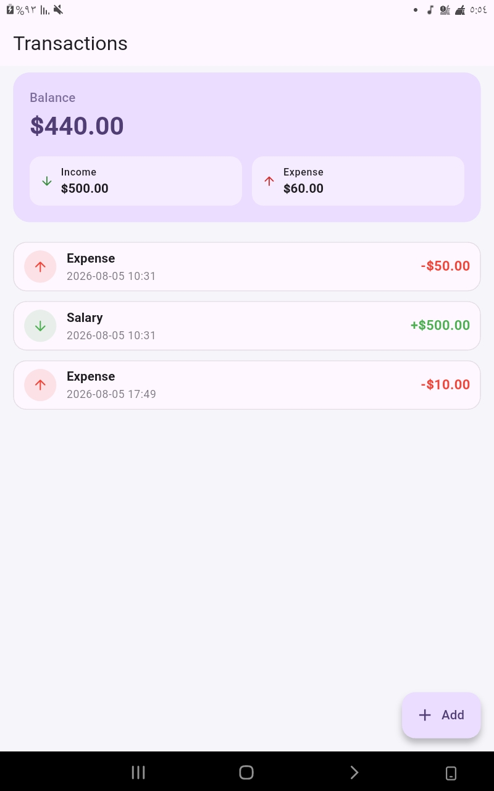
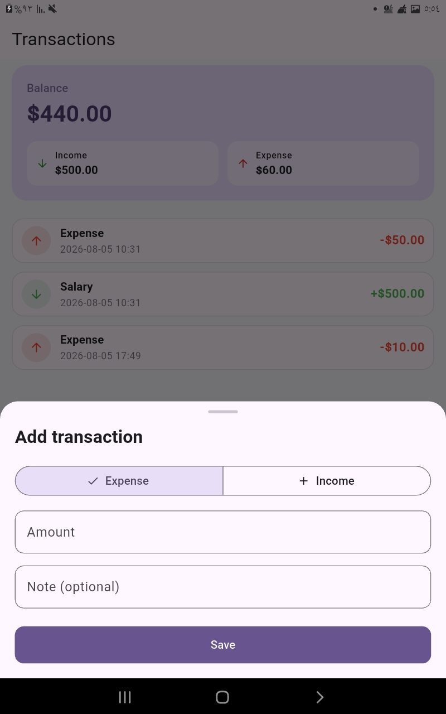
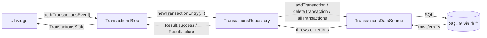
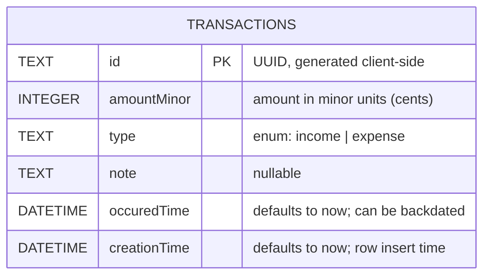

# StockFlow

A Flutter app for tracking income and expenses, built with the **BLoC**
pattern on top of a local **[Drift](https://drift.simonbinder.eu/)** (SQLite)
database.

<p align="center">
  
  &nbsp;&nbsp;
  
</p>

<p align="center">
  <em>Balance summary &amp; transaction list &nbsp;·&nbsp; Add-transaction sheet</em>
</p>

---

## ✨ Features

- 📊 **Balance summary** — live total balance with income/expense breakdown
- 📋 **Transaction list** — card-styled rows with type icon, note, date, and amount
- ➕ **Add transactions** — bottom sheet with an income/expense toggle, amount, and optional note
- 👉 **Swipe to delete** — swipe a row away, then **Undo** within a 5-second countdown before it's permanently deleted
- 💾 **Local persistence** — everything is stored in an on-device SQLite database via Drift

## 🧱 Tech stack

| Layer          | Choice                                                        |
| -------------- | --------------------------------------------------------------|
| State mgmt     | [flutter_bloc](https://pub.dev/packages/flutter_bloc)         |
| Persistence    | [drift](https://pub.dev/packages/drift) (SQLite)               |
| DI             | [get_it](https://pub.dev/packages/get_it)                     |
| IDs            | [uuid](https://pub.dev/packages/uuid) (client-generated v4)   |

## 🚀 Getting started

```bash
flutter pub get
dart run build_runner build --delete-conflicting-outputs
flutter run
```

> The `build_runner` step regenerates Drift's `*.g.dart` files. Re-run it
> whenever a table definition under `lib/transactions/data/models/` changes.

### Running tests

```bash
flutter test
```

## 🗂️ Project structure

The `transactions` feature is organized feature-first:

```
lib/
├── core/
│   ├── result.dart                # Result<T> (Success/Failure) — shared success/error wrapper
│   └── service_locator.dart       # get_it setup — registers TransactionsBloc & friends
└── transactions/
    ├── bloc/                      # TransactionsBloc, events, states
    ├── data/
    │   ├── models/
    │   │   └── transactions.dart  # Drift table definition (Transactions, TransactionType)
    │   ├── repos/
    │   │   └── transactions_repository.dart  # Wraps the data source in Result
    │   ├── connection.dart                   # Platform-specific Drift connection
    │   ├── transactions_data_source.dart     # Drift database class (real persistence)
    │   └── transactions_data_source.g.dart   # Generated by drift_dev — do not edit
    └── presentation/
        ├── format.dart                         # Amount/date formatting helpers
        ├── screens/
        │   └── transactions_screen.dart        # Main screen: summary card + list
        └── widgets/
            ├── add_transaction_sheet.dart       # Bottom sheet for creating a transaction
            └── transaction_tile.dart            # Swipe-to-delete row
```

## 🔄 Data flow



Each layer's job:

- **UI** dispatches an event (`AppLaunchEvent`, `AddTransactionEvent`,
  `DeleteTransactionEvent`) and rebuilds off whatever `TransactionsState` the
  bloc emits. It never sees `Result`, `TransactionsCompanion`, or Drift types.
- **`TransactionsBloc`** emits `Loading(previousData)` immediately, then
  calls the repository. `AddTransactionEvent` carries plain values
  (`amountMinor`, `type`, `note`) — the bloc calls
  `transactionsRepository.newTransactionEntry(...)` to turn those into a
  `TransactionsCompanion` right before the insert, so Drift's generated
  companion type never has to appear in the event API.
- **`TransactionsRepository`** is the only place that imports the Drift data
  source and Drift types directly. It try/catches every call and returns
  `Result<T>` (`Success<T>` or `Failure<String>`) instead of letting
  exceptions propagate — the bloc branches on the result via
  `result.when(success: ..., failure: ...)`.
- Because `addTransaction`/`deleteTransaction` only return a row
  count/id (not the updated list), the bloc re-queries
  `getAllTransactions()` after a successful mutation (see `_refresh` in
  `transactions_bloc.dart`) to get a fresh `Loaded` state — it does not trust
  the mutation's return value to reflect the current table contents.

### Swipe-to-delete + Undo

Deleting is optimistic on the UI side but not on the database side:

1. Swiping a row adds its id to a local `_pendingDeleteIds` set and hides it
   immediately — this keeps the rendered list in sync with what `Dismissible`
   already removed from the widget tree, avoiding a
   "dismissed Dismissible still in tree" crash.
2. A snackbar appears with an animated 5-second countdown bar and an **Undo**
   action.
3. If **Undo** is tapped, the id is removed from the pending set and the row
   reappears — no bloc event is ever dispatched, so nothing is deleted.
4. If the countdown finishes untouched, `DeleteTransactionEvent` fires and
   the row is permanently removed from the database.

## 🗄️ Database schema



### Design decisions

- **`id` is a client-generated UUID (`TEXT`), not an autoincrement integer.**
  Autoincrement IDs only exist after a row commits, which blocks
  optimistic-UI inserts and can collide once multiple devices insert data
  offline and later sync. A UUID can be generated before the insert and stays
  unique across devices with no coordination. Trade-off: slightly larger
  storage per row than an integer key — acceptable for a local, low-volume
  ledger table.
- **`amountMinor` is an `INTEGER` (minor units, e.g. cents), not a `double`.**
  Floating-point can't represent most decimal fractions exactly
  (`0.1 + 0.2 != 0.3` in IEEE 754), so summing amounts as `double` drifts over
  time. Storing whole minor units keeps every arithmetic operation exact;
  conversion to a display string (`$3.50`) happens only at the UI boundary.
- **`type` is a Drift `textEnum<TransactionType>`, not a bare `TEXT` column.**
  The set of valid values is fixed and known (`income`, `expense`), so the
  column is typed to match — the compiler catches typos and invalid values at
  the call site instead of letting malformed strings reach the database.
- **`note` is nullable; `occuredTime`/`creationTime` are not.**
  A transaction doesn't always have a note, so the column allows `NULL`.
  Both timestamps default to "now" via `withDefault(currentDateAndTime)`, but
  `occuredTime` can be overridden on insert to log a backdated transaction,
  while `creationTime` is meant to always reflect actual insert time.

## ✅ What's implemented

- Drift schema for `Transactions` (see above).
- `TransactionsDataSource` with `allTransactions`, `addTransaction`,
  `deleteTransaction`, backed by real SQLite via `sqlite3_flutter_libs`.
- `Result<T>` (`lib/core/result.dart`) — a sealed `Success<T>` / `Failure<T>`
  wrapper with a `when(success:, failure:)` method, used to make
  success/error explicit in return types instead of relying on thrown
  exceptions.
- `TransactionsRepository` — wraps `TransactionsDataSource`, catches
  exceptions and returns `Result<T>`, and exposes `newTransactionEntry(...)`
  so callers never construct a `TransactionsCompanion` directly.
- `TransactionsBloc`, wired end-to-end to `TransactionsRepository` via
  `get_it`. `AppLaunchEvent` / `AddTransactionEvent` / `DeleteTransactionEvent`
  drive `Initial` / `Loading` / `Loaded` / `Error` states typed on
  `List<Transaction>`. `Loading`/`Error` retain the previous list so the UI
  doesn't blank out mid-operation.
- Full presentation layer: transactions screen with balance summary,
  swipe-to-delete with animated undo, and an add-transaction bottom sheet.
- Unit tests:
  - `test/database_test.dart` — inserts, defaults, backdating, enum
    round-tripping, duplicate-id rejection, deletes, empty/multi-row reads.
  - `test/transactions_repository_test.dart` — `newTransactionEntry`
    id/note/type/amount handling, and that `getAllTransactions` /
    `addTransaction` / `deleteTransaction` return `Success`/`Failure`
    correctly, including the duplicate-id → `Failure` conversion.
  - `test/transactions_bloc_test.dart` — `AppLaunchEvent`,
    `AddTransactionEvent`, `DeleteTransactionEvent` state emissions, the
    `_refresh`-after-mutation behavior, and `previousData` carryover.
  - All run against a real in-memory Drift database
    (`NativeDatabase.memory()`) rather than mocks, so no state leaks between
    tests and nothing touches disk.

## 🚧 Not yet done

- No bloc-level test coverage for the `TransactionsError` branch of
  `AddTransactionEvent`/`DeleteTransactionEvent` — forcing a real repository
  failure through the public event API isn't possible (ids are generated
  internally, so duplicate-id collisions can't be triggered from outside).
  Closing this gap needs a mock repository, i.e. adding `bloc_test` +
  `mocktail` as dev dependencies.
- No editing of existing transactions — only add and delete.
- No filtering/search/date-range views over the transaction list.
