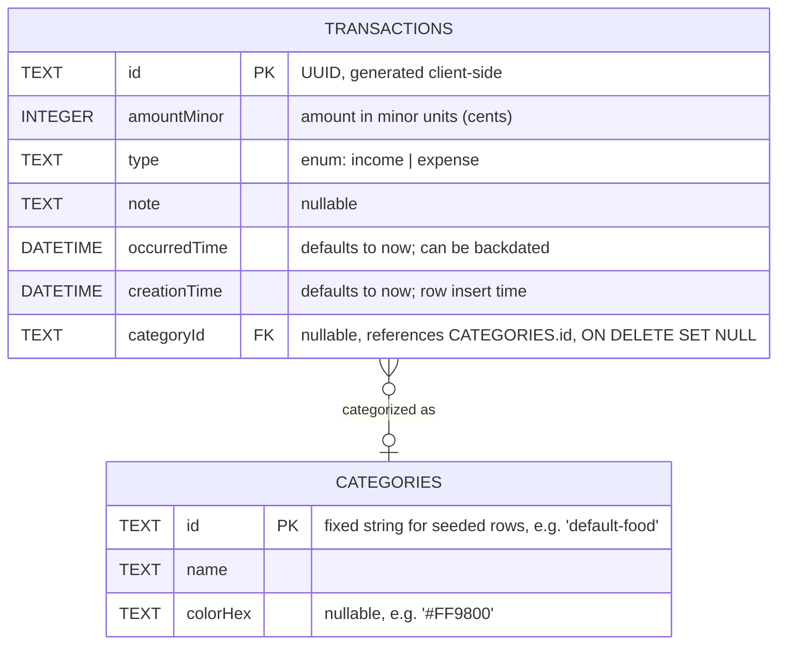

# Money Log

<p align="center">
  
  &nbsp;&nbsp;
  
  &nbsp;&nbsp;
  
  &nbsp;&nbsp;
  
</p>

<p align="center">
  <em>Balance summary &amp; transaction list &nbsp;·&nbsp; Add-transaction sheet &nbsp;·&nbsp; Category picker &nbsp;·&nbsp; Empty state</em>
</p>

<p align="center">
  
  
  
  
  
  <a href="LICENSE"></a>
</p>

<p align="center">
  <a href="https://github.com/Israa050/money-log/releases/latest">
    
  </a>
</p>

<p align="center">
  <a href="https://claude.ai/code/artifact/7ef70167-84d3-4ec5-b1da-6acea789d354">📊 The Reactive Loop — interactive diagram</a>
  &nbsp;·&nbsp;
  <a href="https://claude.ai/code/artifact/97b41c14-86fe-47d7-bbc0-a13aed14b7d2">🖱️ Live transactions demo</a>
</p>

---

## 📖 About

Money Log is a small, focused personal-finance tracker: log income and
expenses, see your balance update instantly, and undo a delete before it's
final. It exists as a reference implementation of a **fully reactive**
Flutter architecture — every screen is driven by a live database stream, not
a fetch-then-render cycle, so the UI is never more than one SQLite write away
from the truth.

The app is built with the **BLoC** pattern on top of
**[Drift](https://drift.simonbinder.eu/)** (a type-safe SQLite layer): a
write lands in the database, Drift's `.watch()` query notices the table
changed, and the new data arrives back at the screen on its own — no manual
refresh, no re-fetch after a mutation, no stale state to reconcile. The UI
itself uses a warm, editorial dark-first design system with distinct
income/expense color language, card-based transaction rows, and swipe-to-
delete with a countdown undo.

## ✨ Features

- 📊 **Balance summary** — live total balance with income/expense breakdown
- 📈 **Spending by category** — a collapsible card showing total expenses grouped by category (plus an "Uncategorized" bucket), each row live-updated the instant a matching transaction is added or deleted
- 📋 **Transaction list** — card-styled rows with type icon, note, date, amount, and a color-coded category tag when one is set
- ➕ **Add transactions** — bottom sheet with an income/expense toggle, amount, optional note, and optional category
- 🏷️ **Categories** — pick from four seeded default categories (Food, Transport, Shopping, Bills) when adding a transaction, shown as color-coded chips; the same colors carry through to the transaction list and the category totals card
- 🗂️ **Manage categories** — a dedicated screen (opened from the transactions app bar) to create, rename/recolor, and delete categories from a fixed swatch palette; deleting a category that still has transactions orphans them into "Uncategorized" instead of failing, and every change propagates live to the add-transaction chips and transaction pills
- 👉 **Swipe to delete** — swipe a row away, then **Undo** within a 5-second countdown before it's permanently deleted
- 🔄 **Fully reactive** — every screen is driven by a live Drift stream; add/delete never trigger a manual reload
- 💾 **Local persistence** — everything is stored in an on-device SQLite database via Drift
- 🪵 **Bloc observability** — every event and state transition is logged through a custom `BlocObserver`
- 🎨 **Themed design system** — light/dark color tokens (`AppColors`), a distinct income/expense
  palette, and a small, composable widget set instead of one large screen file

## 🧱 Tech stack

| Layer          | Choice                                                        |
| -------------- | --------------------------------------------------------------|
| State mgmt     | [flutter_bloc](https://pub.dev/packages/flutter_bloc)         |
| Persistence    | [drift](https://pub.dev/packages/drift) (SQLite)               |
| DI             | [get_it](https://pub.dev/packages/get_it)                     |
| IDs            | [uuid](https://pub.dev/packages/uuid) (client-generated v4)   |
| Logging        | [logger](https://pub.dev/packages/logger)                     |
| Testing        | [bloc_test](https://pub.dev/packages/bloc_test) + [mocktail](https://pub.dev/packages/mocktail) |
| CI             | [GitHub Actions](.github/workflows/flutter-test.yml)          |
| CD             | [GitHub Actions](.github/workflows/deploy-production.yml) + [Firebase App Distribution](https://firebase.google.com/docs/app-distribution) |

## 🚀 Getting started

```bash
flutter pub get
dart run build_runner build --delete-conflicting-outputs
flutter run
```

> The `build_runner` step regenerates Drift's `*.g.dart` files. Re-run it
> whenever a table definition under `lib/transactions/data/models/` changes.

### Running tests

```bash
flutter test
```

Two complementary approaches are used:

- **Drift-backed tests** (`database_test.dart`, `transactions_repository_test.dart`,
  `category_repository_test.dart`, `transactions_bloc_test.dart`, `widget_test.dart`)
  drive a real in-memory Drift database (`NativeDatabase.memory()`) instead of
  mocks, so no state leaks between tests and nothing touches disk.
- **Mocktail-backed bloc/cubit tests** (`transactions_bloc_mocktail_test.dart`,
  `categories_bloc_mocktail_test.dart`, `balance_cubit_mocktail_test.dart`)
  use [`bloc_test`](https://pub.dev/packages/bloc_test) and
  [`mocktail`](https://pub.dev/packages/mocktail) with mocked use cases
  ([`test/helpers/mocks.dart`](test/helpers/mocks.dart)) to assert state
  emissions in isolation, including failure paths a real repository can't be
  forced into (see below).

### Continuous integration

Every pull request into `main` runs
[`.github/workflows/flutter-test.yml`](.github/workflows/flutter-test.yml):
dependency install → Drift code generation → `dart format` check →
`flutter analyze` → `flutter test`. A PR can't merge with a formatting
issue, an analyzer warning, or a failing test.

### Continuous deployment

Pushing to the `production` branch runs
[`.github/workflows/deploy-production.yml`](.github/workflows/deploy-production.yml):
it builds a signed, arm64-only release APK and uploads it to Firebase App
Distribution's `internal` tester group. `production` is a deploy-only
branch, separate from `main`. Full setup steps, the release-signing
approach, and troubleshooting notes are in
[`docs/firebase-app-distribution.md`](docs/firebase-app-distribution.md).

## 🗂️ Project structure

The `transactions` feature is organized feature-first:

```
lib/
├── core/
│   ├── app_bloc_observer.dart     # Logs every Bloc event/state change/error
│   ├── result.dart                # Result<T> (Success/Failure) — shared success/error wrapper
│   ├── service_locator.dart       # get_it setup — binds TransactionsRepository, use cases, Bloc/Cubit
│   └── theme/
│       ├── app_colors.dart        # Semantic color tokens (light/dark) as a ThemeExtension
│       └── app_theme.dart         # Builds ThemeData (app bar, cards, inputs, FAB...) from the tokens
└── transactions/
    ├── bloc/                      # TransactionsBloc, CategoriesBloc, events, states, BalanceCubit, CategoryTotalsCubit — depend on use cases only
    ├── domain/
    │   ├── entities/
    │   │   ├── transaction_entity.dart     # Plain domain model — no Drift types; carries categoryId
    │   │   ├── transaction_type.dart       # income/expense enum, owned by domain
    │   │   ├── category_entity.dart        # Plain domain model — id, name, optional colorHex
    │   │   └── category_total_entity.dart  # One category's total expense — nullable id/name for the "Uncategorized" bucket
    │   ├── repositories/
    │   │   ├── transactions_repository.dart  # Abstract interface — zero data-layer imports
    │   │   └── category_repository.dart      # Abstract interface — reactive watchCategories()/watchCategoryTotals(), Result-returning CRUD writes
    │   └── usecases/
    │       ├── get_transactions_usecase.dart
    │       ├── watch_balance_usecase.dart
    │       ├── add_transaction_usecase.dart
    │       ├── delete_transaction_usecase.dart
    │       ├── watch_categories_usecase.dart
    │       ├── add_category_usecase.dart
    │       ├── update_category_usecase.dart
    │       ├── delete_category_usecase.dart
    │       └── watch_category_totals_usecase.dart
    ├── data/
    │   ├── models/
    │   │   ├── transactions.dart  # Drift table definition (imports TransactionType from domain); categoryId FK -> Categories, ON DELETE SET NULL
    │   │   └── categories.dart    # Drift table definition — id, name, nullable colorHex
    │   ├── repos/
    │   │   ├── transactions_repository_impl.dart  # Implements TransactionsRepository; maps Drift rows <-> entities
    │   │   └── category_repository_impl.dart      # Implements CategoryRepository; maps Drift rows <-> entities, incl. CategoryTotalRow -> CategoryTotalEntity; validates name trim/empty/case-insensitive-duplicate before writing
    │   ├── connection.dart                   # Platform-specific Drift connection
    │   ├── transactions_data_source.dart     # Drift database class (real persistence, schema v3); seeds 4 default categories on create; category CRUD + categoryTotals join query
    │   └── transactions_data_source.g.dart   # Generated by drift_dev — do not edit
    └── presentation/
        ├── format.dart                         # Amount/date formatting + parseHexColor helper (shared by every widget below)
        ├── category_palette.dart               # Fixed 12-swatch hex palette used by the category editor
        ├── screens/
        │   ├── transactions_screen.dart        # Main screen: composes the widgets below; app bar action opens CategoriesScreen
        │   └── categories_screen.dart          # Manage-categories screen: list + add/edit/delete
        └── widgets/
            ├── add_transaction_sheet.dart       # Bottom sheet for creating a transaction
            ├── balance_summary_card.dart        # Balance figure + income/expense stat pills
            ├── category_totals_card.dart        # Collapsible spending-by-category card, reactive via CategoryTotalsCubit
            ├── category_list_tile.dart          # One row on CategoriesScreen: color dot, name, edit/delete icon buttons
            ├── category_editor_sheet.dart       # Bottom sheet for creating or editing a category (name + palette picker)
            ├── delete_category_dialog.dart      # Confirmation dialog warning that orphaned transactions become "Uncategorized"
            ├── stat_pill.dart                   # Single income/expense mini stat
            ├── transaction_tile.dart            # Swipe-to-delete row; shows a category pill when categoryId resolves
            ├── transactions_list.dart           # List/empty-state switch; resolves each row's category by id before rendering
            ├── transactions_empty_state.dart    # "No transactions yet" placeholder
            └── undo_snackbar_content.dart        # Snackbar body with a shrinking countdown bar
```

### Layering

Dependencies point inward, toward `domain/`:

```
presentation → bloc → domain/usecases → domain/repositories (abstract)
                                              ^
                                              |
                                data/repos (implements the interface)
```

- **`domain/`** has zero imports from `data/` — `TransactionEntity`, `TransactionType`,
  and `TransactionsRepository` (the abstract interface) are plain Dart with no
  Drift types anywhere in their signatures.
- **`TransactionsRepositoryImpl`** (in `data/repos/`) is the only place that
  knows both worlds: it implements the domain interface and maps Drift's
  generated `Transaction` rows to/from `TransactionEntity`.
- **Use cases** (`domain/usecases/`) are thin, single-method wrappers around
  one repository call each — `TransactionsBloc`/`BalanceCubit` depend only on
  these, never on `TransactionsRepository` or `TransactionsRepositoryImpl`
  directly.
- **DI** (`service_locator.dart`) binds `TransactionsRepositoryImpl` against
  the abstract `TransactionsRepository` type, so swapping the persistence
  layer later would mean writing a new impl class, not touching the bloc,
  use cases, or domain entities at all.

## 🔄 Reactive data flow

There is no "refresh" step anywhere in this app. A write lands in SQLite,
Drift's `.watch()` query notices the table changed, and the new list arrives
back at the screen on its own.

**→ [Open the interactive loop diagram](https://claude.ai/code/artifact/7ef70167-84d3-4ec5-b1da-6acea789d354)**
for a visual walkthrough of the cycle described below.

```mermaid
flowchart LR
    UI["UI (BlocBuilder)"] -- "add(AppLaunchEvent)" --> Bloc[TransactionsBloc]
    Bloc -- "getTransactionsUseCase()\n(once, held in _subscription)" --> UC[GetTransactionsUseCase]
    UC --> Repo["TransactionsRepository\n(impl)"]
    Repo -- "select(transactions).watch()" --> DS[TransactionsDataSource]
    DS -- "SQL" --> DB[(SQLite via drift)]
    DB -- "table changed → re-run query" --> DS
    DS -- "Drift row" --> Repo
    Repo -- "TransactionEntity stream" --> UC
    UC -- "stream tick" --> Bloc
    Bloc -- "add(_TransactionsUpdated)\n→ emit(Loaded(data))" --> UI

    Sheet["AddTransactionSheet"] -- "add(AddTransactionEvent /\nDeleteTransactionEvent)" --> Bloc
    Bloc -- "addTransactionUseCase / deleteTransactionUseCase" --> Repo
    Bloc -. "emit(TransactionsError)\non failure only" .-> Sheet

    CatUI["CategoryTotalsCard\n(BlocBuilder)"] -- "subscribes once,\nin constructor" --> CatCubit[CategoryTotalsCubit]
    CatCubit --> CatUC[WatchCategoryTotalsUsecase]
    CatUC --> CatRepo["CategoryRepository\n(impl)"]
    CatRepo -- "leftOuterJoin + groupBy,\nwhere type == expense" --> DS
    DS -- "CategoryTotalRow list" --> CatRepo
    CatRepo -- "CategoryTotalEntity stream" --> CatUC
    CatUC -- "stream tick" --> CatCubit
    CatCubit -- "emit(totals)\ndirectly, no bridging event" --> CatUI
```



Each piece's job:

- **`TransactionsDataSource.allTransactions`** is a `Stream<List<Transaction>>`
  built from `select(transactions).watch()` — not a one-shot `Future`. Drift
  re-runs the query and re-emits automatically whenever a row in the
  `transactions` table changes.
- **`TransactionsRepositoryImpl.getAllTransactions()`** maps each Drift
  `Transaction` row to a `TransactionEntity` and passes the stream straight
  through — no `async`, no `Result<T>`. Writes (`addTransaction` /
  `deleteTransaction`) stay plain `Future<Result<T>>` and never return the
  updated list; the stream re-emitting is what updates the UI, not the
  write's return value.
- **`GetTransactionsUseCase` / `AddTransactionUseCase` / `DeleteTransactionUseCase`
  / `WatchBalanceUseCase`** are thin, single-method (`call(...)`) wrappers
  around one repository call each. `TransactionsBloc`/`BalanceCubit` depend
  only on these — never on `TransactionsRepository` directly — so the bloc
  layer never sees a Drift type.
- **`TransactionsBloc`** subscribes to `getTransactionsUseCase()` exactly
  once, in `_onLaunch` (guarded against double-subscribing), and stores the
  `StreamSubscription` in `_subscription`. Every tick is bridged through a
  private `_TransactionsUpdated` event (a Bloc handler can't `emit()` from
  inside a raw stream callback), which emits `Loaded(data)`.
  `AddTransactionEvent`/`DeleteTransactionEvent` handlers call the
  corresponding use case and **emit nothing on success** — the already-live
  subscription picks up the change on its own. They only emit
  `TransactionsError` if the write itself fails.
- **`_subscription.cancel()` in `close()`** is the one step with no automatic
  safety net (highlighted in the diagram). Skipping it leaks the Drift query
  listener past the Bloc's lifetime — since `TransactionsBloc` is a
  `getIt.registerFactory` instance created fresh per screen, forgetting this
  leaves one more orphaned subscription running after every navigation.
- **`AddTransactionSheet`** dispatches `AddTransactionEvent` and disables its
  submit button locally (`_isSubmitting`) while waiting — not via a Bloc
  `Loading` state, since none exists on the write path. A `BlocListener`
  (guarded by `listenWhen: (_, __) => _isSubmitting`) pops the sheet on the
  next `Loaded` and shows an inline error on `TransactionsError`, so failures
  surface before the sheet is dismissed instead of as a disconnected
  snackbar afterward.
- **`CategoryTotalsCubit`** follows the same aggregate-stream shape as
  `BalanceCubit`, not `TransactionsBloc`: it subscribes to
  `WatchCategoryTotalsUsecase()` once in its constructor and calls `emit`
  directly from the stream listener. A `Cubit` can do this safely — only a
  `Bloc` needs the private-event bridging trick `TransactionsBloc` uses,
  because a `Bloc`'s `emit` is only valid inside an event handler, while a
  `Cubit` has no such restriction.

### Swipe-to-delete + Undo

Deleting is optimistic on the UI side but not on the database side:

1. Swiping a row adds its id to a local `_pendingDeleteIds` set and hides it
   immediately — this keeps the rendered list in sync with what `Dismissible`
   already removed from the widget tree, avoiding a
   "dismissed Dismissible still in tree" crash.
2. A snackbar appears with an animated 5-second countdown bar and an **Undo**
   action.
3. If **Undo** is tapped, the id is removed from the pending set and the row
   reappears — no bloc event is ever dispatched, so nothing is deleted.
4. If the countdown finishes untouched, `DeleteTransactionEvent` fires and
   the row is permanently removed from the database; the live subscription
   reflects the deletion automatically.

### Observability

`main()` installs a custom `BlocObserver`
([`lib/core/app_bloc_observer.dart`](lib/core/app_bloc_observer.dart)) via
`Bloc.observer = AppBlocObserver()` before `runApp`. It logs, through the
[`logger`](https://pub.dev/packages/logger) package:

- **`onEvent`** — every dispatched event (`AppLaunchEvent`,
  `AddTransactionEvent`, the internal `_TransactionsUpdated`, ...)
- **`onChange`** — every state transition (`TransactionsInitial` → `Loaded`,
  → `TransactionsError`, ...)
- **`onError`** — anything thrown inside a Bloc handler that wasn't already
  caught

This gives a full console trace of the reactive cycle above — useful for
seeing exactly when a stream tick reaches the Bloc versus when a write
handler runs.

## 🗄️ Database schema



### Design decisions

- **`id` is a client-generated UUID (`TEXT`), not an autoincrement integer.**
  Autoincrement IDs only exist after a row commits, which blocks
  optimistic-UI inserts and can collide once multiple devices insert data
  offline and later sync. A UUID can be generated before the insert and stays
  unique across devices with no coordination. Trade-off: slightly larger
  storage per row than an integer key — acceptable for a local, low-volume
  ledger table.
- **`amountMinor` is an `INTEGER` (minor units, e.g. cents), not a `double`.**
  Floating-point can't represent most decimal fractions exactly
  (`0.1 + 0.2 != 0.3` in IEEE 754), so summing amounts as `double` drifts over
  time. Storing whole minor units keeps every arithmetic operation exact;
  conversion to a display string (`$3.50`) happens only at the UI boundary.
- **`type` is a Drift `textEnum<TransactionType>`, not a bare `TEXT` column.**
  The set of valid values is fixed and known (`income`, `expense`), so the
  column is typed to match — the compiler catches typos and invalid values at
  the call site instead of letting malformed strings reach the database.
- **`note` is nullable; `occurredTime`/`creationTime` are not.**
  A transaction doesn't always have a note, so the column allows `NULL`.
  Both timestamps default to "now" via `withDefault(currentDateAndTime)`, but
  `occurredTime` can be overridden on insert to log a backdated transaction,
  while `creationTime` is meant to always reflect actual insert time.
- **`categoryId`'s foreign key is `ON DELETE SET NULL`, not the SQLite default
  (`NO ACTION`) or `CASCADE`.** With categories now deletable, `NO ACTION`
  would make deleting any category with transactions attached throw a
  constraint violation (SQLite enforces this immediately —
  `beforeOpen` turns `PRAGMA foreign_keys = ON`). `CASCADE` was rejected too:
  deleting a category is removing an organizational label, not disputing
  that money was spent, so silently destroying the transactions themselves
  would be the wrong failure mode for a finance app. `SET NULL` orphans the
  transaction into the existing "Uncategorized" bucket instead — a state
  `watchCategoryTotals()`/`CategoryTotalsCard` already render correctly, so
  no new UI branch was needed for it. This changed the schema
  (`schemaVersion` 2 → 3) via a `TableMigration`, since SQLite can't `ALTER`
  a column's foreign-key action in place — drift's `alterTable` rebuilds the
  table (create-copy-drop-rename) with the new constraint.
- **`CategoryRepository.watchCategories()` returns a `Stream<List<CategoryEntity>>`,
  not a one-shot `Future`** (this replaced the original `Future`-returning
  `getCategories()` once a manage-categories screen existed). A `Future`
  fetched once in `TransactionsBloc._onLaunch` meant a category created,
  renamed, or deleted on the new screen would not appear anywhere else —
  the add-transaction chips, the transaction-tile pills — until the app
  restarted, which contradicts this app's whole "no manual refresh"
  premise. `TransactionsBloc` now holds a second `StreamSubscription`
  (alongside the transactions one) feeding a private `_CategoriesUpdated`
  event, so both streams merge into the same `Loaded.categories` field.
  Trade-off: because the two subscriptions start independently and Drift
  gives no guarantee about which one's first tick lands first, a fresh
  `AppLaunchEvent` can legitimately emit `Loaded` more than once before
  settling — callers should assert on the final state, not the emission
  count (see `transactions_bloc_test.dart`'s "settles on Loaded([])" test).
- **Category name uniqueness is enforced in `CategoryRepositoryImpl`, not as a
  SQL `UNIQUE` constraint.** Adding a unique index would need its own schema
  migration; validating in the repository (trim, reject empty, reject a
  case-insensitive duplicate via `findCategoryByName`) gives the same
  guarantee without one, and returns a `Result.failure` with a message the
  UI can show directly instead of parsing a raw SQLite constraint error.
  Case-insensitivity matters because SQLite's default text collation is
  case-sensitive (`BINARY`), so `name.equals(...)` alone would let
  `"groceries"` and `"Groceries"` coexist — `findCategoryByName` compares
  `.lower()` on both sides specifically to close that gap.
- **The four seeded default categories are not protected from edit or
  delete.** They're ordinary rows distinguished only by their fixed
  `'default-*'` ids, not a special "system category" flag — a user can
  rename, recolor, or remove any of them. Protecting them would mean a
  disabled delete button the user can't act on and a `startsWith('default-')`
  check leaking into the UI layer, for a restriction nothing in the product
  actually calls for; an empty category list is already a handled state
  (the add sheet hides its chips section, `CategoriesScreen` shows an empty
  state).
- **The category color picker is a fixed swatch palette
  (`kCategoryPalette`, 12 hex strings), not a free-form color picker
  package.** A full HSV/RGB picker (e.g. `flutter_colorpicker`) would add a
  dependency to an intentionally lean `pubspec.yaml` (no UI packages beyond
  Flutter/Cupertino today) and lets a user pick a color that's illegible
  against the app's `surface` color in one of the two themes. A curated
  palette — a superset of the four seeded colors — is guaranteed to render
  visibly in both light and dark mode, at the cost of not offering unlimited
  color choice.
- **`AddTransactionEvent`/`addTransaction(...)` take a plain `String? categoryId`,
  not a `CategoryEntity?`.** Keeping the write path on primitive ids (the same
  pattern `deleteTransaction(String id)` already uses) avoids the
  `transactions` domain/repository layer importing `CategoryEntity` just to
  read `.id` off it — a repository whose job is "persist a transaction"
  doesn't need to know what a category *is*, only its foreign key.
- **`categoryId` is threaded through `TransactionsBloc`, not fetched directly
  by `AddTransactionSheet` via `get_it`.** `WatchCategoriesUseCase` is a
  constructor dependency of `TransactionsBloc` (alongside the other three use
  cases), subscribed to in `_onLaunch` and carried in `Loaded.categories`.
  The alternative — the sheet calling `getIt<WatchCategoriesUseCase>()()`
  directly in a `StreamBuilder` — would bypass the bloc layer and introduce a
  second, inconsistent way widgets access use cases in this codebase; every
  other read/write already goes through the bloc, so categories do too.
- **Category CRUD lives in a new `CategoriesBloc`, not folded into
  `TransactionsBloc`.** `TransactionsBloc` only ever *reads* categories (for
  the chips/pills); it has no reason to also own `AddCategoryEvent`/
  `UpdateCategoryEvent`/`DeleteCategoryEvent` and their error states —
  doing so would bloat one bloc with two unrelated responsibilities and
  couple `CategoriesScreen`'s lifecycle to `TransactionsScreen`'s
  `BlocProvider`. This mirrors how `BalanceCubit` and `CategoryTotalsCubit`
  are already separate from `TransactionsBloc` despite reading the same
  tables — single-responsibility blocs, not one mega-bloc, is the
  established pattern here.
- **4 default categories (Food, Transport, Shopping, Bills) are seeded via
  `onCreate` in `TransactionsDataSource`'s `MigrationStrategy`, with fixed
  string ids (`'default-food'`, etc.) instead of generated UUIDs.** `onCreate`
  only fires for brand-new databases, so existing dev installs that already
  migrated to schema v2 do **not** retroactively get seeded rows — acceptable
  pre-release, but would need a backfill migration once real user data exists.
- **`categoryTotals` uses a `leftOuterJoin`, not an inner join, and filters to
  `type == expense` at the query level rather than inside the sum.** An inner
  join would silently drop every transaction with `categoryId == null` from
  the result set, so "spending by category" would quietly under-report
  instead of showing an honest "Uncategorized" bucket — the left join is what
  makes that bucket reachable at all. Filtering with `..where(...)` before
  `groupBy` (rather than `sum(filter: ...)`, as `balance` does) was chosen
  because this query only ever needs one type, not two sums side by side, so
  restricting the row set up front is simpler than filtering per-aggregate.
- **`CategoryRepositoryImpl` maps `TypedResult` rows to a plain
  `CategoryTotalRow` class inside `TransactionsDataSource.categoryTotals`,
  not inside the repository.** Drift's joined-query expressions
  (`categories.id`, the `Sum` aggregate, etc.) only exist in scope where the
  query itself is built; re-declaring them in the repository to call
  `row.read(...)` there would create second, independent expression
  instances not guaranteed to match the ones the query actually used. Doing
  the `TypedResult` → plain-object mapping at the data source boundary keeps
  every Drift-specific type — including `TypedResult` itself — from ever
  crossing into `data/repos/`, `domain/`, or above.

## ✅ What's implemented

- Drift schema for `Transactions` (see above), with a `.watch()`-backed
  `allTransactions` stream alongside `addTransaction`/`deleteTransaction`,
  backed by real SQLite via `sqlite3_flutter_libs`.
- `Result<T>` (`lib/core/result.dart`) — a sealed `Success<T>` / `Failure<T>`
  wrapper with a `when(success:, failure:)` method, used for write results
  (`addTransaction`, `deleteTransaction`) instead of letting exceptions
  propagate.
- A domain layer (`lib/transactions/domain/`) that decouples the bloc from
  Drift entirely:
  - `TransactionEntity` / `TransactionType` — plain Dart models with no
    Drift dependency.
  - `TransactionsRepository` — the abstract interface the domain and bloc
    layers depend on; has zero imports from `data/`.
  - Four use cases (`GetTransactionsUseCase`, `WatchBalanceUseCase`,
    `AddTransactionUseCase`, `DeleteTransactionUseCase`) — single-method
    (`call(...)`) wrappers around one repository call each.
  - `TransactionsRepositoryImpl` (in `data/repos/`) implements the
    interface and is the only place that maps Drift `Transaction` rows
    to/from `TransactionEntity`.
- `TransactionsBloc`, fully reactive and wired end-to-end to its use cases
  via `get_it` (never to the repository directly). Two long-lived stream
  subscriptions — transactions and, as of this release, categories — are
  started on `AppLaunchEvent` and cancelled together in `close()`; writes
  only emit on failure (`TransactionsError`).
- **Category management (new):** categories are now a fully editable
  resource, not a fixed set of four seeded rows.
  - `Categories` Drift table (`id`, `name`, nullable `colorHex`), schema
    v3, with `transactions.categoryId`'s FK changed to `ON DELETE SET
    NULL` via a `TableMigration` — deleting a category with transactions
    attached orphans them instead of throwing a constraint error.
  - `CategoryRepository`/`CategoryRepositoryImpl` grew a reactive
    `watchCategories()` (replacing the old one-shot `getCategories()`) plus
    `Result`-returning `addCategory`/`updateCategory`/`deleteCategory`,
    with trim/empty/case-insensitive-duplicate name validation done in the
    repository rather than a SQL constraint.
  - Four new use cases (`WatchCategoriesUseCase`, `AddCategoryUseCase`,
    `UpdateCategoryUseCase`, `DeleteCategoryUseCase`) and a new
    `CategoriesBloc` (mirroring `TransactionsBloc`'s shape: a `CategoriesLoaded`/
    `CategoriesError` state pair with `previousData` preserved across
    failures) that owns category mutation, kept separate from
    `TransactionsBloc`, which only reads categories.
  - A new `CategoriesScreen` (reached via an app-bar icon on the
    transactions screen), `CategoryEditorSheet` (add/edit, name field +
    a fixed 12-swatch color palette) and `DeleteCategoryDialog`
    (warns that orphaned transactions become "Uncategorized").
    `AddTransactionSheet`'s `ChoiceChip` picker is now sourced from
    `TransactionsBloc`'s live category stream, so a category created,
    renamed, or deleted on the new screen is reflected everywhere
    instantly — no restart required (see
    [Design decisions](#design-decisions) above for the full set of
    trade-offs: `ON DELETE SET NULL` vs. blocking/cascading,
    `Future`-vs-`Stream`, in-repository validation vs. a SQL constraint,
    and the fixed palette vs. a color-picker package).
- Reactive total spending per category: `TransactionsDataSource.categoryTotals`
  joins `transactions` to `categories` via a `leftOuterJoin`, filters to
  expense transactions, and groups by `categoryId`, so uncategorized spend
  surfaces as its own bucket instead of being dropped. Wired end-to-end
  through `CategoryTotalEntity`, `CategoryRepository.watchCategoryTotals()`,
  `WatchCategoryTotalsUsecase`, and `CategoryTotalsCubit` (an aggregate-stream
  cubit shaped like `BalanceCubit`, not `TransactionsBloc` — see
  [Reactive data flow](#-reactive-data-flow) above), rendered by
  `CategoryTotalsCard`. The card is collapsible: tapping its header toggles
  an animated expand/collapse (local widget state, not persisted) to free
  vertical space for the transaction list below; the grand total stays
  visible in both states.
- Category visibility on transactions: `TransactionEntity` now carries
  `categoryId` through from the Drift row, and `TransactionTile` renders a
  small colored pill (dot + category name) next to the transaction title
  when one resolves — `TransactionsList` builds a `categoryId -> CategoryEntity`
  lookup map once per build so each row resolves its category in O(1) rather
  than scanning the category list per row. No pill renders for an
  uncategorized transaction.
- `AppBlocObserver` — logs every Bloc event, state change, and error via the
  `logger` package.
- Full presentation layer: transactions screen with balance summary,
  swipe-to-delete with animated undo, and an add-transaction bottom sheet
  with local submit-in-flight UI state.
- GitHub Actions CI (`.github/workflows/flutter-test.yml`) running format
  checks, static analysis, and the full test suite on every PR into `main`.
- Unit tests, all run against a real in-memory Drift database
  (`NativeDatabase.memory()`) rather than mocks:
  - `test/database_test.dart` — inserts, defaults, backdating, enum
    round-tripping, duplicate-id rejection, deletes, empty/multi-row reads,
    and that the `allTransactions` stream re-emits after a change; a
    `Categories` group covers the same shape for category CRUD plus the
    key regression test for this release — deleting a category referenced
    by a transaction sets `categoryId` to `null` instead of throwing
    (verifying `ON DELETE SET NULL` against a real SQLite constraint, not
    just application code).
  - `test/transactions_repository_test.dart` — `TransactionsRepositoryImpl`
    against a real Drift database: `addTransaction` note/type/amount
    handling and distinct-id generation, `getAllTransactions` stream
    behavior (including reactivity), and `addTransaction`/`deleteTransaction`
    `Success`/`Failure` results.
  - `test/category_repository_test.dart` (new) — `CategoryRepositoryImpl`
    against a real Drift database: name trim/empty/case-insensitive-duplicate
    validation on add and update, that renaming a category to its own
    current name is not treated as a duplicate, `watchCategories()`
    reactivity, and that deleting a category with transactions attached
    orphans their spend into the `"Uncategorized"` bucket of
    `watchCategoryTotals()`.
  - `test/transactions_bloc_test.dart` — `TransactionsBloc` built from real
    use cases over a real Drift database: `AppLaunchEvent`,
    `AddTransactionEvent`, `DeleteTransactionEvent` state emissions under the
    stream-driven model, the double-subscription guard, and that writes emit
    nothing on success (only the subscription does). Because
    `AppLaunchEvent` now starts two independent stream subscriptions
    (transactions and categories) with no guaranteed ordering, its "empty
    table" test asserts on the settled state rather than a single expected
    emission.
  - `test/widget_test.dart` — boots the full widget tree against an
    in-memory database with proper teardown.
- Mocktail-backed bloc/cubit unit tests, mocking the use cases each bloc
  actually depends on (`test/helpers/mocks.dart`) rather than the
  repository, so each test isolates exactly at the bloc's real dependency
  boundary:
  - `test/transactions_bloc_mocktail_test.dart` — `TransactionsBloc` against
    mocked `GetTransactionsUseCase`/`AddTransactionUseCase`/
    `DeleteTransactionUseCase`/`WatchCategoriesUseCase`:
    - `AppLaunchEvent`: stream success → `Loaded`; stream error →
      `TransactionsError` (covers the `onError` handling added to the
      launch subscription).
    - `AddTransactionEvent` / `DeleteTransactionEvent`: success → no direct
      emission (call verified via `verify(...).called(1)`); failure →
      `TransactionsError`, asserted both with no prior state (empty
      `previousData`) and seeded from a prior `Loaded` state (`previousData`
      preserved) — failure branches a real repository can't be forced into,
      since ids are generated internally and duplicate-id collisions aren't
      reachable through the public event API.
  - `test/categories_bloc_mocktail_test.dart` (new) — `CategoriesBloc`
    against mocked `WatchCategoriesUseCase`/`AddCategoryUseCase`/
    `UpdateCategoryUseCase`/`DeleteCategoryUseCase`, covering the same
    success/failure/`previousData`-preservation shape as
    `transactions_bloc_mocktail_test.dart` for `AddCategoryEvent`,
    `UpdateCategoryEvent`, and `DeleteCategoryEvent`.
  - `test/balance_cubit_mocktail_test.dart` — `BalanceCubit` against a mocked
    `WatchBalanceUseCase`: initial state is `0` before the stream emits, a
    single stream value is re-emitted as-is, and multiple stream values are
    emitted in order.

## 🚧 Not yet done

- No editing of existing transactions — only add and delete.
- No filtering/search/date-range views over the transaction list.
- No protection against deleting all categories at once, beyond the add
  sheet and category list both handling an empty category set gracefully.

## 🏷️ Release notes

### v0.4.0 — Manage categories

- Added full category CRUD behind a new "Manage Categories" screen (opened
  from the transactions app bar): create, rename/recolor via a fixed
  swatch palette, and delete.
- Changed `transactions.categoryId`'s foreign key to `ON DELETE SET NULL`
  (schema v2 → v3, via a drift `TableMigration`) so deleting a category
  with transactions attached orphans them into "Uncategorized" instead of
  throwing a constraint error.
- `CategoryRepository.watchCategories()` replaced the old one-shot
  `getCategories()`, and `TransactionsBloc` now holds a second stream
  subscription for it — a category created, renamed, or deleted propagates
  to the add-transaction chips and transaction pills immediately.
- Added `addCategory`/`updateCategory`/`deleteCategory` (all `Result`-returning)
  with name validation — trimmed, non-empty, case-insensitive-duplicate
  rejected — enforced in the repository rather than a SQL constraint.
- Added a new `CategoriesBloc` for category mutation, kept separate from
  `TransactionsBloc` (which only reads categories), matching the existing
  `BalanceCubit`/`CategoryTotalsCubit` single-responsibility split.
- Added Drift-backed tests for category CRUD and the orphaning behavior,
  a `CategoryRepositoryImpl` test suite mirroring
  `transactions_repository_test.dart`, and mocktail-based
  `CategoriesBloc` tests mirroring `transactions_bloc_mocktail_test.dart`.

### v0.3.0 — Category totals & tags

- Added reactive total spending per category: a Drift `leftOuterJoin` +
  `groupBy` query (`TransactionsDataSource.categoryTotals`), wired through a
  new `CategoryTotalEntity`, `CategoryRepository.watchCategoryTotals()`,
  `WatchCategoryTotalsUsecase`, and `CategoryTotalsCubit` to a new
  `CategoryTotalsCard` on the transactions screen. Uncategorized spend
  surfaces as its own bucket instead of being dropped; income transactions
  never inflate a category's total.
- Made `CategoryTotalsCard` collapsible — tapping its header animates an
  expand/collapse to free space for the transaction list below.
- `TransactionEntity` now carries `categoryId`, and `TransactionTile` shows
  a color-coded category pill next to the transaction title when one is set.
- Fixed a pre-existing bottom-sheet overflow in `AddTransactionSheet` by
  wrapping its form `Column` in a `SingleChildScrollView`.

### v0.2.0 — Themed redesign

- Introduced a dedicated design system (`AppColors` + `AppTheme`) with
  light and dark color tokens — dark-first, following the system theme by
  default — replacing the single generic Material seed color.
- Split the 350+ line `transactions_screen.dart` into small, single-purpose
  widgets (`BalanceSummaryCard`, `StatPill`, `TransactionsList`,
  `TransactionsEmptyState`, `UndoSnackBarContent`), leaving the screen file
  as pure composition and state wiring.
- Restyled `TransactionTile` and `AddTransactionSheet` to match the new
  visual language: circular type icons on income/expense wash colors,
  card-style rows, and a segmented add/expense toggle.
- Refreshed the app screenshots to reflect the new look.

### v0.1.0 — Reactive core

- `TransactionsBloc` made fully reactive via a single long-lived Drift
  `.watch()` subscription — add/delete no longer trigger a manual refetch.
- Added a DB-computed `BalanceCubit` stream and hardened amount parsing
  (exact minor-unit arithmetic, no floating-point drift).
- Full presentation layer: balance summary, swipe-to-delete with animated
  undo, and an add-transaction bottom sheet.
- Drift-backed `Transactions` schema, `TransactionsRepository`, and
  `AppBlocObserver` for full event/state logging.
- GitHub Actions CI running format checks, static analysis, and the full
  test suite on every PR into `main`.

## 📄 License

[MIT](LICENSE) — free to use, modify, and distribute, with no warranty.
