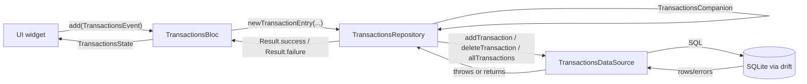
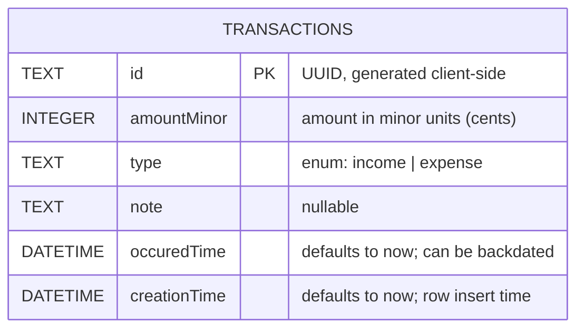

# StockFlow

A Flutter application for tracking transactions, built with the BLoC pattern
and a local [Drift](https://drift.simonbinder.eu/) (SQLite) database.

## Recent updates

- Added `lib/core/result.dart`: a sealed `Result<T>` (`Success<T>` /
  `Failure<T>`) so repository methods can return success/failure explicitly
  instead of throwing.
- Added `TransactionsRepository` (`lib/transactions/data/repos/`), wrapping
  `TransactionsDataSource` in `Result` and exposing `newTransactionEntry(...)`
  to build a `TransactionsCompanion` from plain values.
- Rewired `TransactionsBloc` off `FakeRepository` onto `TransactionsRepository`
  — events and states now carry `Transaction`/plain values instead of `String`.
  See [Data flow](#data-flow) below for the full picture.
- Added `test/transactions_repository_test.dart` and
  `test/transactions_bloc_test.dart` covering the new repository and bloc
  wiring (see [What's implemented so far](#whats-implemented-so-far)).

## Getting Started

```bash
flutter pub get
dart run build_runner build --delete-conflicting-outputs
flutter run
```

The `build_runner` step regenerates `*.g.dart` files whenever a Drift table
definition changes — run it again after editing anything under
`lib/transactions/data/models/`.

## Architecture

The `transactions` feature is organized feature-first:

```
lib/
├── core/
│   └── result.dart              # Result<T> (Success/Failure) — shared success/error wrapper
└── transactions/
    ├── bloc/                     # TransactionsBloc, events, states
    ├── data/
    │   ├── models/
    │   │   └── transactions.dart # Drift table definition (Transactions, TransactionType)
    │   ├── repos/
    │   │   ├── transactions_repository.dart # Real repo — wraps the data source in Result
    │   │   └── fake_repository.dart          # Unused now; kept until UI wiring is confirmed
    │   ├── transactions_data_source.dart    # Drift database class (real persistence)
    │   └── transactions_data_source.g.dart  # Generated by drift_dev — do not edit
    └── presentation/              # UI (not yet built)
```

`TransactionsBloc` now talks to `TransactionsRepository`, which wraps
`TransactionsDataSource` (the real Drift/SQLite implementation) and converts
thrown exceptions into `Result.failure(...)` so the bloc never needs
try/catch. `fake_repository.dart` is no longer referenced anywhere and can be
deleted once the presentation layer is built and confirmed working against
the real repository.

### Data flow



Each layer's job:

- **UI** dispatches an event (`AppLaunchEvent`, `AddTransactionEvent`,
  `DeleteTransactionEvent`) and rebuilds off whatever `TransactionsState` the
  bloc emits. It never sees `Result`, `TransactionsCompanion`, or Drift types.
- **`TransactionsBloc`** emits `Loading(previousData)` immediately, then
  calls the repository. `AddTransactionEvent` carries plain values
  (`amountMinor`, `type`, `note`) — the bloc calls
  `transactionsRepository.newTransactionEntry(...)` to turn those into a
  `TransactionsCompanion` right before the insert, so Drift's generated
  companion type never has to appear in the event API.
- **`TransactionsRepository`** is the only place that imports the Drift data
  source and Drift types directly. It try/catches every call and returns
  `Result<T>` (`Success<T>` or `Failure<String>`) instead of letting
  exceptions propagate — the bloc branches on the result via
  `result.when(success: ..., failure: ...)`.
- Because `addTransaction`/`deleteTransaction` only return a row
  count/id (not the updated list), the bloc re-queries
  `getAllTransactions()` after a successful mutation (see `_refresh` in
  `transactions_bloc.dart`) to get a fresh `Loaded` state — it does not trust
  the mutation's return value to reflect the current table contents.

## Database schema



### Design decisions

- **`id` is a client-generated UUID (`TEXT`), not an autoincrement integer.**
  Autoincrement IDs only exist after a row commits, which blocks
  optimistic-UI inserts and can collide once multiple devices insert data
  offline and later sync. A UUID can be generated before the insert and stays
  unique across devices with no coordination. Trade-off: slightly larger
  storage per row than an integer key — acceptable for a local, low-volume
  ledger table.
- **`amountMinor` is an `INTEGER` (minor units, e.g. cents), not a `double`.**
  Floating-point can't represent most decimal fractions exactly
  (`0.1 + 0.2 != 0.3` in IEEE 754), so summing amounts as `double` drifts over
  time. Storing whole minor units keeps every arithmetic operation exact;
  conversion to a display string (`$3.50`) happens only at the UI boundary.
- **`type` is a Drift `textEnum<TransactionType>`, not a bare `TEXT` column.**
  The set of valid values is fixed and known (`income`, `expense`), so the
  column is typed to match — the compiler catches typos and invalid values at
  the call site instead of letting malformed strings reach the database.
- **`note` is nullable; `occuredTime`/`creationTime` are not.**
  A transaction doesn't always have a note, so the column allows `NULL`.
  Both timestamps default to "now" via `withDefault(currentDateAndTime)`, but
  `occuredTime` can be overridden on insert to log a backdated transaction,
  while `creationTime` is meant to always reflect actual insert time.

## What's implemented so far

- ✅ Drift schema for `Transactions` (see above).
- ✅ `TransactionsDataSource` with `allTransactions`, `addTransaction`,
  `deleteTransaction`, backed by real SQLite via `sqlite3_flutter_libs`.
- ✅ `Result<T>` (`lib/core/result.dart`) — a sealed `Success<T>` /
  `Failure<T>` wrapper with a `when(success:, failure:)` method, used to
  make success/error explicit in return types instead of relying on thrown
  exceptions.
- ✅ `TransactionsRepository` — wraps `TransactionsDataSource`, catches
  exceptions and returns `Result<T>`, and exposes `newTransactionEntry(...)`
  so callers never construct a `TransactionsCompanion` directly.
- ✅ `TransactionsBloc` now wired to `TransactionsRepository` (no longer
  `FakeRepository`). `AppLaunchEvent` / `AddTransactionEvent` /
  `DeleteTransactionEvent` drive `Initial` / `Loading` / `Loaded` / `Error`
  states typed on `List<Transaction>` (the bloc previously used
  `List<String>` against the fake repo). `Loading`/`Error` retain the
  previous list so the UI doesn't blank out mid-operation.
- ✅ Unit tests:
  - `test/database_test.dart` — inserts, defaults, backdating, enum
    round-tripping, duplicate-id rejection, deletes, empty/multi-row reads.
  - `test/transactions_repository_test.dart` — `newTransactionEntry`
    id/note/type/amount handling, and that `getAllTransactions` /
    `addTransaction` / `deleteTransaction` return `Success`/`Failure`
    correctly, including the duplicate-id → `Failure` conversion.
  - `test/transactions_bloc_test.dart` — `AppLaunchEvent`,
    `AddTransactionEvent`, `DeleteTransactionEvent` state emissions, the
    `_refresh`-after-mutation behavior, and `previousData` carryover.
  - All run against a real in-memory Drift database
    (`NativeDatabase.memory()`) rather than mocks, so no state leaks between
    tests and nothing touches disk.

## Not yet done

- No UI is wired up yet (`presentation/` is a placeholder); `TransactionsBloc`
  has no widget consuming it and isn't constructed anywhere in `main.dart`.
- `fake_repository.dart` is unused and can be deleted once the presentation
  layer is confirmed working against the real repository.
- No bloc-level test coverage for the `TransactionsError` branch of
  `AddTransactionEvent`/`DeleteTransactionEvent` — forcing a real repository
  failure through the public event API isn't possible (ids are generated
  internally, so duplicate-id collisions can't be triggered from outside).
  Closing this gap needs a mock repository, i.e. adding `bloc_test` +
  `mocktail` as dev dependencies.

## Running tests

```bash
flutter test
```
