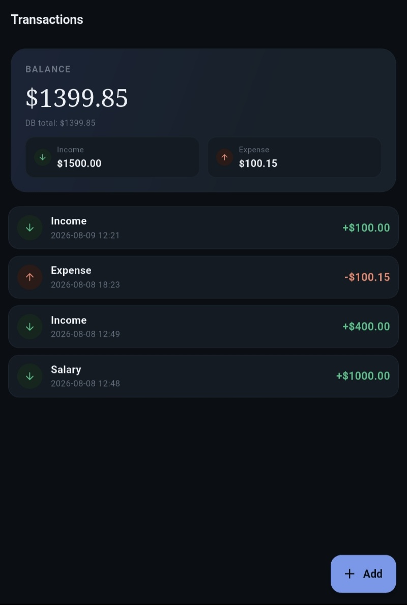
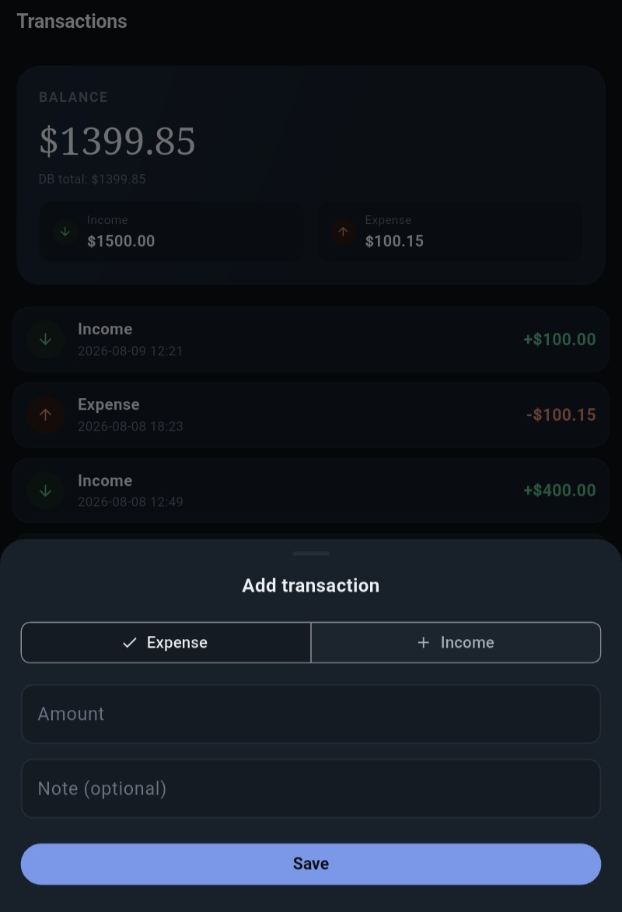
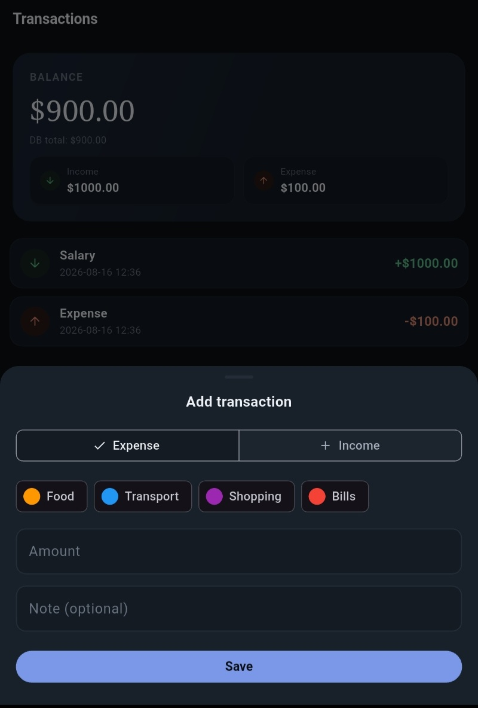
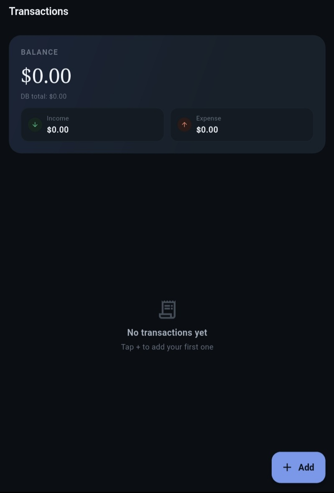
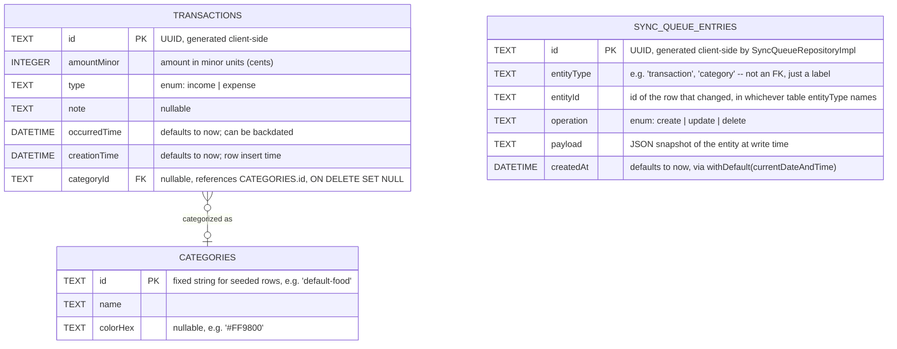

# Money Log

<p align="center">
  
  &nbsp;&nbsp;
  
  &nbsp;&nbsp;
  
  &nbsp;&nbsp;
  
</p>

<p align="center">
  <em>Balance summary &amp; transaction list &nbsp;·&nbsp; Add-transaction sheet &nbsp;·&nbsp; Category picker &nbsp;·&nbsp; Empty state</em>
</p>

<p align="center">
  
  
  
  
  
  <a href="LICENSE"></a>
</p>

<p align="center">
  <a href="https://github.com/Israa050/money-log/releases/latest">
    
  </a>
</p>

<p align="center">
  <a href="https://claude.ai/code/artifact/7ef70167-84d3-4ec5-b1da-6acea789d354">📊 The Reactive Loop — interactive diagram</a>
  &nbsp;·&nbsp;
  <a href="https://claude.ai/code/artifact/97b41c14-86fe-47d7-bbc0-a13aed14b7d2">🖱️ Live transactions demo</a>
</p>

---

## 📖 About

Money Log is a small, focused personal-finance tracker: log income and
expenses, see your balance update instantly, and undo a delete before it's
final. It exists as a reference implementation of a **fully reactive**
Flutter architecture — every screen is driven by a live database stream, not
a fetch-then-render cycle, so the UI is never more than one SQLite write away
from the truth.

The app is built with the **BLoC** pattern on top of
**[Drift](https://drift.simonbinder.eu/)** (a type-safe SQLite layer): a
write lands in the database, Drift's `.watch()` query notices the table
changed, and the new data arrives back at the screen on its own — no manual
refresh, no re-fetch after a mutation, no stale state to reconcile. The UI
itself uses a warm, editorial dark-first design system with distinct
income/expense color language, card-based transaction rows, and swipe-to-
delete with a countdown undo.

## ✨ Features

- 📊 **Balance summary** — live total balance with income/expense breakdown
- 📈 **Spending by category** — a collapsible card showing total expenses grouped by category (plus an "Uncategorized" bucket), each row live-updated the instant a matching transaction is added or deleted
- 📋 **Transaction list** — card-styled rows with type icon, note, date, amount, and a color-coded category tag when one is set
- ➕ **Add transactions** — bottom sheet with an income/expense toggle, amount, optional note, and optional category
- 🏷️ **Categories** — pick from four seeded default categories (Food, Transport, Shopping, Bills) when adding a transaction, shown as color-coded chips; the same colors carry through to the transaction list and the category totals card
- 🗂️ **Manage categories** — a dedicated screen (opened from the transactions app bar) to create, rename/recolor, and delete categories from a fixed swatch palette; deleting a category that still has transactions orphans them into "Uncategorized" instead of failing, and every change propagates live to the add-transaction chips and transaction pills
- 👉 **Swipe to delete** — swipe a row away, then **Undo** within a 5-second countdown before it's permanently deleted
- 🔄 **Fully reactive** — every screen is driven by a live Drift stream; add/delete never trigger a manual reload
- 💾 **Local persistence** — everything is stored in an on-device SQLite database via Drift
- 📤 **Export data** — an app-bar action serializes every transaction and category to a single JSON file (off the main isolate) and opens the OS share sheet, doubling as a manual backup for this offline-first app
- 🪵 **Bloc observability** — every event and state transition is logged through a custom `BlocObserver`
- 🎨 **Themed design system** — light/dark color tokens (`AppColors`), a distinct income/expense
  palette, and a small, composable widget set instead of one large screen file

## 🧱 Tech stack

| Layer          | Choice                                                        |
| -------------- | --------------------------------------------------------------|
| State mgmt     | [flutter_bloc](https://pub.dev/packages/flutter_bloc)         |
| Persistence    | [drift](https://pub.dev/packages/drift) (SQLite)               |
| DI             | [get_it](https://pub.dev/packages/get_it)                     |
| Connectivity   | [connectivity_plus](https://pub.dev/packages/connectivity_plus) |
| Sharing        | [share_plus](https://pub.dev/packages/share_plus) (export file → OS share sheet) |
| IDs            | [uuid](https://pub.dev/packages/uuid) (client-generated v4)   |
| Logging        | [logger](https://pub.dev/packages/logger)                     |
| Testing        | [bloc_test](https://pub.dev/packages/bloc_test) + [mocktail](https://pub.dev/packages/mocktail) |
| CI             | [GitHub Actions](.github/workflows/flutter-test.yml)          |
| CD             | [GitHub Actions](.github/workflows/deploy-production.yml) + [Firebase App Distribution](https://firebase.google.com/docs/app-distribution) |

## 🚀 Getting started

```bash
flutter pub get
dart run build_runner build --delete-conflicting-outputs
flutter run
```

> The `build_runner` step regenerates Drift's `*.g.dart` files. Re-run it
> whenever a table definition under `lib/features/transactions/data/models/`,
> `lib/features/categories/data/models/`, or `lib/core/sync/data/models/`
> changes.

### Running tests

```bash
flutter test
```

Two complementary approaches are used:

- **Drift-backed tests** (`database_test.dart`, `transactions_repository_test.dart`,
  `category_repository_test.dart`, `transactions_bloc_test.dart`, `widget_test.dart`)
  drive a real in-memory Drift database (`NativeDatabase.memory()`) instead of
  mocks, so no state leaks between tests and nothing touches disk.
- **Mocktail-backed bloc/cubit tests** (`transactions_bloc_mocktail_test.dart`,
  `categories_bloc_mocktail_test.dart`, `balance_cubit_mocktail_test.dart`)
  use [`bloc_test`](https://pub.dev/packages/bloc_test) and
  [`mocktail`](https://pub.dev/packages/mocktail) with mocked use cases
  ([`test/helpers/mocks.dart`](test/helpers/mocks.dart)) to assert state
  emissions in isolation, including failure paths a real repository can't be
  forced into (see below).

### Continuous integration

Every pull request into `main` runs
[`.github/workflows/flutter-test.yml`](.github/workflows/flutter-test.yml):
dependency install → Drift code generation → `dart format` check →
`flutter analyze` → `flutter test`. A PR can't merge with a formatting
issue, an analyzer warning, or a failing test.

### Continuous deployment

Pushing to the `production` branch runs
[`.github/workflows/deploy-production.yml`](.github/workflows/deploy-production.yml):
it builds a signed, arm64-only release APK and uploads it to Firebase App
Distribution's `internal` tester group. `production` is a deploy-only
branch, separate from `main`. Full setup steps, the release-signing
approach, and troubleshooting notes are in
[`docs/firebase-app-distribution.md`](docs/firebase-app-distribution.md).

## 🗂️ Project structure

The app is organized feature-first under `lib/features/`, with genuinely
cross-cutting concerns (connectivity, the offline sync queue, theming) kept
in `lib/core/` instead of inside any one feature:

```
lib/
├── core/
│   ├── app_bloc_observer.dart     # Logs every Bloc event/state change/error
│   ├── result.dart                # Result<T> (Success/Failure) — shared success/error wrapper
│   ├── service_locator.dart       # get_it setup — binds every repository, use case, Bloc/Cubit
│   ├── connectivity/              # Cross-cutting network-status layer (not a feature — see below)
│   │   ├── domain/
│   │   │   ├── network_status.dart          # online/offline enum, owned by domain
│   │   │   ├── connectivity_repository.dart # Abstract interface — zero data-layer/plugin imports
│   │   │   └── usecases/
│   │   │       └── watch_connectivity_usecase.dart
│   │   ├── data/
│   │   │   └── connectivity_repository_impl.dart # Wraps connectivity_plus; maps ConnectivityResult -> NetworkStatus
│   │   └── cubit/
│   │       └── connectivity_cubit.dart      # Broadcasts NetworkStatus app-wide; registered as a singleton
│   ├── sync/                      # Offline outbox layer (not a feature — see below)
│   │   ├── domain/
│   │   │   ├── entities/
│   │   │   │   ├── operation_type.dart          # create/update/delete enum, owned by domain
│   │   │   │   └── sync_queue_entry_entity.dart # Plain domain model for one queued entry (not yet consumed — no read path exists)
│   │   │   ├── repositories/
│   │   │   │   └── sync_queue_repository.dart   # Abstract interface — enqueue(...), watchPendingCount()
│   │   │   └── usecases/
│   │   │       └── watch_pending_sync_count_usecase.dart
│   │   └── data/
│   │       ├── models/
│   │       │   └── sync_queue_entries.dart      # Drift table definition — id, entityType, entityId, operation, payload, createdAt
│   │       └── repos/
│   │           └── sync_queue_repository_impl.dart # Implements SyncQueueRepository against TransactionsDataSource
│   └── theme/
│       ├── app_colors.dart        # Semantic color tokens (light/dark) as a ThemeExtension
│       └── app_theme.dart         # Builds ThemeData (app bar, cards, inputs, FAB...) from the tokens
└── features/
    ├── transactions/
    │   ├── bloc/                  # TransactionsBloc, BalanceCubit — depend on use cases only
    │   ├── domain/
    │   │   ├── entities/
    │   │   │   ├── transaction_entity.dart     # Plain domain model — no Drift types; carries categoryId
    │   │   │   └── transaction_type.dart       # income/expense enum, owned by domain
    │   │   ├── repositories/
    │   │   │   └── transactions_repository.dart  # Abstract interface — zero data-layer imports
    │   │   └── usecases/
    │   │       ├── get_transactions_usecase.dart
    │   │       ├── watch_balance_usecase.dart
    │   │       ├── add_transaction_usecase.dart
    │   │       └── delete_transaction_usecase.dart
    │   ├── data/
    │   │   ├── models/
    │   │   │   └── transactions.dart  # Drift table definition (imports TransactionType from domain); categoryId FK -> Categories, ON DELETE SET NULL
    │   │   ├── repos/
    │   │   │   └── transactions_repository_impl.dart  # Implements TransactionsRepository; maps Drift rows <-> entities; every write is wrapped in one atomic Drift transaction() alongside a SyncQueueRepository.enqueue() call
    │   │   ├── connection.dart                   # Platform-specific Drift connection
    │   │   ├── transactions_data_source.dart     # The single Drift database class (real persistence, schema v4) for Transactions, Categories, AND SyncQueueEntries — see note below
    │   │   └── transactions_data_source.g.dart   # Generated by drift_dev — do not edit
    │   └── presentation/
    │       ├── format.dart                         # Amount/date formatting + parseHexColor helper (shared across features)
    │       ├── screens/
    │       │   └── transactions_screen.dart        # Main screen: composes the widgets below; app bar action opens CategoriesScreen
    │       └── widgets/
    │           ├── add_transaction_sheet.dart       # Bottom sheet for creating a transaction
    │           ├── balance_summary_card.dart        # Balance figure + income/expense stat pills
    │           ├── stat_pill.dart                   # Single income/expense mini stat
    │           ├── transaction_tile.dart            # Swipe-to-delete row; shows a category pill when categoryId resolves
    │           ├── transactions_list.dart           # List/empty-state switch; resolves each row's category by id before rendering
    │           ├── transactions_empty_state.dart    # "No transactions yet" placeholder
    │           └── undo_snackbar_content.dart        # Snackbar body with a shrinking countdown bar
    └── categories/
        ├── bloc/
        │   ├── categories_bloc.dart        # Owns category CRUD; separate from TransactionsBloc, which only reads categories
        │   ├── categories_event.dart
        │   ├── categories_state.dart
        │   └── category_totals_cubit.dart  # Aggregate-stream cubit shaped like BalanceCubit
        ├── domain/
        │   ├── entities/
        │   │   ├── category_entity.dart        # Plain domain model — id, name, optional colorHex
        │   │   └── category_total_entity.dart  # One category's total expense — nullable id/name for the "Uncategorized" bucket
        │   ├── repositories/
        │   │   └── category_repository.dart      # Abstract interface — reactive watchCategories()/watchCategoryTotals(), Result-returning CRUD writes
        │   └── usecases/
        │       ├── watch_categories_usecase.dart
        │       ├── add_category_usecase.dart
        │       ├── update_category_usecase.dart
        │       ├── delete_category_usecase.dart
        │       └── watch_category_totals_usecase.dart
        ├── data/
        │   ├── models/
        │   │   └── categories.dart    # Drift table definition — id, name, nullable colorHex
        │   └── repos/
        │       └── category_repository_impl.dart  # Implements CategoryRepository against TransactionsDataSource; maps Drift rows <-> entities, incl. CategoryTotalRow -> CategoryTotalEntity; validates name trim/empty/case-insensitive-duplicate; every write wrapped in an atomic transaction() + enqueue()
        └── presentation/
            ├── category_palette.dart               # Fixed 12-swatch hex palette used by the category editor
            ├── screens/
            │   └── categories_screen.dart          # Manage-categories screen: list + add/edit/delete
            └── widgets/
                ├── category_totals_card.dart        # Collapsible spending-by-category card, reactive via CategoryTotalsCubit
                ├── category_list_tile.dart          # One row on CategoriesScreen: color dot, name, edit/delete icon buttons
                ├── category_editor_sheet.dart       # Bottom sheet for creating or editing a category (name + palette picker)
                └── delete_category_dialog.dart      # Confirmation dialog warning that orphaned transactions become "Uncategorized"
    └── backup/
        ├── cubit/
        │   ├── export_cubit.dart            # ExportCubit -- single export() method, one ExportDataUseCase dependency
        │   └── export_state.dart            # ExportState: Idle / InProgress / Success(file) / Failure(message)
        ├── domain/
        │   ├── entities/
        │   │   ├── exportable_source.dart   # Abstract source contract -- key + exportRows(); the OCP seam (see below)
        │   │   └── exported_file.dart       # Plain result value -- path, byteSize, countsByKey
        │   ├── backup_repository.dart       # Abstract interface -- exportToJson() is its only method
        │   └── usecases/
        │       └── export_data_usecase.dart # Thin call() wrapper around BackupRepository.exportToJson()
        ├── data/
        │   ├── export_serializer.dart       # Pure functions (no Flutter/Drift imports) -- buildEnvelope + encodeExport, the Isolate.run payload
        │   └── backup_repository_impl.dart  # Implements BackupRepository; loops ExportableSources, spawns the isolate, writes the temp file
        └── presentation/
            └── widgets/
                └── export_action.dart       # App bar IconButton; BlocConsumer drives spinner/snackbars and the share_plus call
```

> **Why `Categories` and `SyncQueueEntries` live inside
> `transactions_data_source.dart` instead of their own feature's `data/`
> folder:** Drift transactions and foreign keys cannot span two separate
> `@DriftDatabase` classes — there is exactly one SQLite connection/file for
> the whole app, `transactions.sqlite`, and every table shares it. The table
> *definitions* (`categories.dart`, `sync_queue_entries.dart`) live under
> their own feature/module folder and are just imported into
> `transactions_data_source.dart`'s `@DriftDatabase(tables: [...])` list —
> only the physical database class itself has to be shared. This is what
> makes the atomic-write guarantee below possible: a transaction row and its
> sync-queue row can be written in one Drift `transaction()` block only
> because they're on the same connection.

### Layering

Dependencies point inward, toward `domain/`, within each feature — and
`core/sync` sits underneath every feature that writes data:

```
presentation → bloc → domain/usecases → domain/repositories (abstract)
                                              ^
                                              |
                                data/repos (implements the interface)
                                              |
                                              v
                                  core/sync: SyncQueueRepository (abstract)
                                              ^
                                              |
                                core/sync/data/repos (implements the interface)
```

- **`domain/`** has zero imports from `data/` in any feature — `TransactionEntity`,
  `TransactionType`, `TransactionsRepository` (the abstract interface), and
  the equivalents in `categories/` and `core/sync/` are plain Dart with no
  Drift types anywhere in their signatures.
- **`TransactionsRepositoryImpl`** and **`CategoryRepositoryImpl`** (in each
  feature's `data/repos/`) are the only places that know both worlds: they
  implement their domain interface, map Drift's generated rows to/from
  entities, *and* coordinate the atomic write + sync-queue-enqueue described
  below.
- **Use cases** (`domain/usecases/`) are thin, single-method wrappers around
  one repository call each — blocs/cubits depend only on these, never on a
  repository interface or impl directly.
- **`SyncQueueRepository`** is depended on by `TransactionsRepositoryImpl`
  and `CategoryRepositoryImpl` the same way any repository depends on
  another narrow interface — those repositories know `enqueue(entityType:,
  entityId:, operation:, payload:)`, never `SyncQueueEntries`'s Drift schema
  or how a queue row's `id`/`createdAt` are generated. This keeps every
  future repository that needs to enqueue (there will be more than these
  two) from duplicating `SyncQueueEntriesCompanion`-building logic — that
  knowledge lives in exactly one place, `SyncQueueRepositoryImpl`.
- **DI** (`service_locator.dart`) binds every `*Impl` against its abstract
  interface type, so swapping the persistence layer later would mean
  writing a new impl class, not touching any bloc, use case, or domain
  entity at all.

## 🔄 Reactive data flow

There is no "refresh" step anywhere in this app. A write lands in SQLite,
Drift's `.watch()` query notices the table changed, and the new list arrives
back at the screen on its own.

**→ [Open the interactive loop diagram](https://claude.ai/code/artifact/7ef70167-84d3-4ec5-b1da-6acea789d354)**
for a visual walkthrough of the cycle described below.

```mermaid
flowchart LR
    UI["UI (BlocBuilder)"] -- "add(AppLaunchEvent)" --> Bloc[TransactionsBloc]
    Bloc -- "getTransactionsUseCase()\n(once, held in _subscription)" --> UC[GetTransactionsUseCase]
    UC --> Repo["TransactionsRepository\n(impl)"]
    Repo -- "select(transactions).watch()" --> DS[TransactionsDataSource]
    DS -- "SQL" --> DB[(SQLite via drift)]
    DB -- "table changed → re-run query" --> DS
    DS -- "Drift row" --> Repo
    Repo -- "TransactionEntity stream" --> UC
    UC -- "stream tick" --> Bloc
    Bloc -- "add(_TransactionsUpdated)\n→ emit(Loaded(data))" --> UI

    Sheet["AddTransactionSheet"] -- "add(AddTransactionEvent /\nDeleteTransactionEvent)" --> Bloc
    Bloc -- "addTransactionUseCase / deleteTransactionUseCase" --> Repo
    Bloc -. "emit(TransactionsError)\non failure only" .-> Sheet

    CatUI["CategoryTotalsCard\n(BlocBuilder)"] -- "subscribes once,\nin constructor" --> CatCubit[CategoryTotalsCubit]
    CatCubit --> CatUC[WatchCategoryTotalsUsecase]
    CatUC --> CatRepo["CategoryRepository\n(impl)"]
    CatRepo -- "leftOuterJoin + groupBy,\nwhere type == expense" --> DS
    DS -- "CategoryTotalRow list" --> CatRepo
    CatRepo -- "CategoryTotalEntity stream" --> CatUC
    CatUC -- "stream tick" --> CatCubit
    CatCubit -- "emit(totals)\ndirectly, no bridging event" --> CatUI
```



Each piece's job:

- **`TransactionsDataSource.allTransactions`** is a `Stream<List<Transaction>>`
  built from `select(transactions).watch()` — not a one-shot `Future`. Drift
  re-runs the query and re-emits automatically whenever a row in the
  `transactions` table changes.
- **`TransactionsRepositoryImpl.getAllTransactions()`** maps each Drift
  `Transaction` row to a `TransactionEntity` and passes the stream straight
  through — no `async`, no `Result<T>`. Writes (`addTransaction` /
  `deleteTransaction`) stay plain `Future<Result<T>>` and never return the
  updated list; the stream re-emitting is what updates the UI, not the
  write's return value.
- **`GetTransactionsUseCase` / `AddTransactionUseCase` / `DeleteTransactionUseCase`
  / `WatchBalanceUseCase`** are thin, single-method (`call(...)`) wrappers
  around one repository call each. `TransactionsBloc`/`BalanceCubit` depend
  only on these — never on `TransactionsRepository` directly — so the bloc
  layer never sees a Drift type.
- **`TransactionsBloc`** subscribes to `getTransactionsUseCase()` exactly
  once, in `_onLaunch` (guarded against double-subscribing), and stores the
  `StreamSubscription` in `_subscription`. Every tick is bridged through a
  private `_TransactionsUpdated` event (a Bloc handler can't `emit()` from
  inside a raw stream callback), which emits `Loaded(data)`.
  `AddTransactionEvent`/`DeleteTransactionEvent` handlers call the
  corresponding use case and **emit nothing on success** — the already-live
  subscription picks up the change on its own. They only emit
  `TransactionsError` if the write itself fails.
- **`_subscription.cancel()` in `close()`** is the one step with no automatic
  safety net (highlighted in the diagram). Skipping it leaks the Drift query
  listener past the Bloc's lifetime — since `TransactionsBloc` is a
  `getIt.registerFactory` instance created fresh per screen, forgetting this
  leaves one more orphaned subscription running after every navigation.
- **`AddTransactionSheet`** dispatches `AddTransactionEvent` and disables its
  submit button locally (`_isSubmitting`) while waiting — not via a Bloc
  `Loading` state, since none exists on the write path. A `BlocListener`
  (guarded by `listenWhen: (_, __) => _isSubmitting`) pops the sheet on the
  next `Loaded` and shows an inline error on `TransactionsError`, so failures
  surface before the sheet is dismissed instead of as a disconnected
  snackbar afterward.
- **`CategoryTotalsCubit`** follows the same aggregate-stream shape as
  `BalanceCubit`, not `TransactionsBloc`: it subscribes to
  `WatchCategoryTotalsUsecase()` once in its constructor and calls `emit`
  directly from the stream listener. A `Cubit` can do this safely — only a
  `Bloc` needs the private-event bridging trick `TransactionsBloc` uses,
  because a `Bloc`'s `emit` is only valid inside an event handler, while a
  `Cubit` has no such restriction.

### Swipe-to-delete + Undo

Deleting is optimistic on the UI side but not on the database side:

1. Swiping a row adds its id to a local `_pendingDeleteIds` set and hides it
   immediately — this keeps the rendered list in sync with what `Dismissible`
   already removed from the widget tree, avoiding a
   "dismissed Dismissible still in tree" crash.
2. A snackbar appears with an animated 5-second countdown bar and an **Undo**
   action.
3. If **Undo** is tapped, the id is removed from the pending set and the row
   reappears — no bloc event is ever dispatched, so nothing is deleted.
4. If the countdown finishes untouched, `DeleteTransactionEvent` fires and
   the row is permanently removed from the database; the live subscription
   reflects the deletion automatically.

### Observability

`main()` installs a custom `BlocObserver`
([`lib/core/app_bloc_observer.dart`](lib/core/app_bloc_observer.dart)) via
`Bloc.observer = AppBlocObserver()` before `runApp`. It logs, through the
[`logger`](https://pub.dev/packages/logger) package:

- **`onEvent`** — every dispatched event (`AppLaunchEvent`,
  `AddTransactionEvent`, the internal `_TransactionsUpdated`, ...)
- **`onChange`** — every state transition (`TransactionsInitial` → `Loaded`,
  → `TransactionsError`, ...)
- **`onError`** — anything thrown inside a Bloc handler that wasn't already
  caught

This gives a full console trace of the reactive cycle above — useful for
seeing exactly when a stream tick reaches the Bloc versus when a write
handler runs.

### Offline sync queue (transactional outbox)

Every write to `Transactions` or `Categories` also writes a row to
`SyncQueueEntries` — the local durable record of "this needs to reach the
server eventually." This is a **transactional outbox**: the pattern of
writing a business-data change and an "outbox" event in one atomic
transaction, so a separate background process can drain the outbox and
publish those events (here, to Supabase) without ever risking the data
change and the sync record disagreeing about what happened. The actual
background drain/push-to-Supabase process is not built yet — only the write
side (the outbox itself) exists so far.

- **Every write always enqueues, online or offline.** There is exactly one
  code path for every write: local DB write, then enqueue — never a
  connectivity check that branches into "write directly to the server" vs.
  "queue it." A background sync process (not yet built) is the only thing
  that will ever talk to Supabase; from the repository's point of view,
  being online changes nothing about how a write happens, only how soon the
  eventual drain might run. This was a deliberate choice over branching on
  connectivity: a single path is easier to test and reason about, and it
  sidesteps a real failure mode the branching approach can't avoid — being
  "online" at write time doesn't guarantee a direct network write actually
  succeeds, so the offline/fallback path would need to exist and be correct
  regardless.
- **The data write and the enqueue are wrapped in one Drift `transaction()`.**
  `TransactionsRepositoryImpl.addTransaction`/`deleteTransaction` and
  `CategoryRepositoryImpl.addCategory`/`updateCategory`/`deleteCategory` each
  open `dataSource.transaction(() async { ... })`, perform the actual
  insert/update/delete, then call `syncQueueRepository.enqueue(...)` before
  the block closes. If either half fails, Drift rolls back both — there is
  no window where a transaction/category row exists with no matching queue
  entry (which would mean it silently never syncs), and no window where a
  queue entry exists for a write that never actually committed (a "phantom"
  sync). Because `enqueue()` returns a `Result<int>` rather than throwing,
  and Drift's `transaction()` only rolls back on a *thrown* exception, a
  returned `Failure` from `enqueue` is deliberately re-thrown inside the
  transaction block and re-caught just outside it, converting it back to
  `Result` for the caller — see the comment at the throw site in
  `transactions_repository_impl.dart` for why.
- **`payload` is a full snapshot, captured at write time — not a pointer to
  re-fetch later.** `SyncQueueEntries.payload` holds a JSON-encoded copy of
  the entity's data (id, amount, type, note, category, etc. for a
  transaction) at the moment of the write, not just the row's id. The
  alternative — storing only `entityId` and having the eventual drain
  process re-read the current row from local storage — was rejected because
  this app is offline-first by design: a write can sit unsynced for an
  unbounded time, and if the underlying row gets deleted locally before the
  drain ever runs, a pointer-based design would have nothing left to
  re-fetch and would silently lose that `create`/`update` event. A snapshot
  is self-sufficient — the queue row alone has everything needed to replay
  the write, independent of whatever local storage looks like by the time
  it's drained.
- **`SyncQueueRepository` is the only place that knows how to build a queue
  row.** Callers (`TransactionsRepositoryImpl`, `CategoryRepositoryImpl`)
  pass plain values — `entityType`, `entityId`, `operation`, `payload` —
  never a `SyncQueueEntriesCompanion`. `id` (a generated UUID) and
  `createdAt` (a Drift-side default, `withDefault(currentDateAndTime)`, the
  same pattern `Transactions.occurredTime` uses) are owned entirely by
  `SyncQueueRepositoryImpl`, so a third repository added later needs zero
  knowledge of the queue table's schema to participate — just the same
  four-value `enqueue(...)` call every existing writer already makes.
- **What's still open:** the background process that actually drains
  `SyncQueueEntries` and pushes to Supabase does not exist yet, and there is
  no `synced`/status column on the table — every row currently counts as
  "pending" by definition, since nothing marks or removes a row once it's
  been enqueued. `SyncQueueRepository.watchPendingCount()` (backed by a
  `COUNT(*)` over the table) reflects that: it's a true pending count today
  only because nothing has drained anything yet.

### Export data (manual backup)

An app-bar action (`ExportAction`, next to "Manage categories" on
`TransactionsScreen`) serializes every transaction and category into one
JSON file and hands it to the OS share sheet via `share_plus`. This is
**not** the sync queue above — the outbox replays individual writes to a
future server; export is a user-triggered, point-in-time snapshot of
current state, read fresh from the database and independent of whatever is
sitting unsynced in `SyncQueueEntries`. For an offline-first app with no
server yet, this is the only real backup path a user has today.

- **A new `backup/` feature, not folded into `transactions/` or
  `categories/`.** Export reads across both features' domains, and neither
  should have to import the other's entities just to support a
  cross-cutting capability — so `backup/` is its own feature, the one
  place allowed to depend on both, while nothing depends on it.
- **`ExportableSource` is the Open/Closed seam.** `BackupRepositoryImpl`
  takes a `List<ExportableSource>` in its constructor and never imports
  `TransactionsRepository` or `CategoryRepository` directly — it only
  knows `source.key` (a string used as the JSON key) and
  `source.exportRows()` (a `Future<List<Map<String, Object?>>>`).
  `TransactionsExportSource` and `CategoriesExportSource` (living beside
  each feature's own repository impl, in `data/repos/`) are the only two
  places that know how to turn a `TransactionEntity`/`CategoryEntity` into
  a plain map. Adding a third exportable table later — a future
  `BudgetsExportSource`, say — means writing one new class and adding one
  line to the `sources: [...]` list in `service_locator.dart`;
  `BackupRepositoryImpl` itself never needs to change.
- **Only the JSON encode runs on a background isolate — not the DB read.**
  `BackupRepositoryImpl.exportToJson()` calls each source's `exportRows()`
  on the main isolate first (cheap: a handful of repository/Drift calls),
  collects the results into one `Map<String, List<Map<String, Object?>>>`,
  then hands only that plain, isolate-safe data to
  `await Isolate.run(() => encodeExport(sourceData))`. `encodeExport` and
  `buildEnvelope` (`lib/features/backup/data/export_serializer.dart`) are
  deliberately pure top-level functions with no Flutter or Drift imports —
  nothing they close over is tied to the main isolate, and they're
  unit-testable with no database or widget tree at all. The honest caveat:
  `jsonEncode` is not always the expensive half of an export — row mapping
  and the Drift read can cost as much or more for a given dataset size: if
  a benchmark ever shows the query itself dominating, the isolate boundary
  can move earlier (e.g. `Drift`'s `computeWithDatabase`) without changing
  `BackupRepository`'s interface.
- **The envelope has its own `formatVersion`, separate from Drift's
  `schemaVersion`.** The two can change independently: a new export field
  bumps `formatVersion`; a new table/column bumps the database's
  `schemaVersion` (currently 4, recorded in the envelope only as
  diagnostic info). `'counts'` in the envelope is computed generically —
  `sourceData.map((key, rows) => MapEntry(key, rows.length))` — so it
  reflects however many sources actually ran, with no hardcoded field per
  table.
- **Timestamps are ISO-8601 UTC strings; `amountMinor` stays an integer.**
  Same reasoning as the database schema itself (see
  [Design decisions](#design-decisions) below): JSON has no native date
  type, so `DateTime` must become a string at the export boundary, and UTC
  keeps it unambiguous across devices/timezones. Emitting a decimal amount
  instead of minor units would reintroduce exactly the floating-point
  drift the schema was designed to avoid.
- **The file is written to the OS temp directory, not app documents.**
  `getTemporaryDirectory()` (via `path_provider`, already a dependency),
  because the file is a transient hand-off to the share sheet — not app
  state Money Log owns or needs to keep around after the user has saved it
  somewhere else.
- **`ExportCubit` has exactly one public method, `export()`, and an
  in-flight guard (`if (state is ExportInProgress) return;`).** Matches
  `BalanceCubit`/`CategoryTotalsCubit`'s choice of `Cubit` over `Bloc` —
  one action, no event vocabulary needed. Unlike every other write in this
  app (`AddTransactionEvent`, `AddCategoryEvent`, ...), which emit nothing
  on success because a live Drift stream updates the UI instead, export
  has no such stream: `ExportSuccess(file)` is the only signal the UI will
  ever get, so the use case's return value has to be carried into state
  directly.
- **Not yet built:** import/restore (the envelope's `formatVersion` and
  category-first field ordering are designed to make this possible later,
  but no reader exists yet), CSV export, scheduled/automatic backups, and
  encryption — the exported file is plaintext financial data, which is
  worth knowing before sharing it through the OS share sheet.

## 🗄️ Database schema



`SyncQueueEntries` deliberately has **no foreign key** to `Transactions` or
`Categories` — `entityType`/`entityId` are a soft reference by design, since
the whole point of the outbox is to keep a durable, replay-safe record of a
write that must survive the original row being deleted before the queue is
ever drained (see [Offline sync queue](#offline-sync-queue-transactional-outbox)
above).

### Design decisions

- **`id` is a client-generated UUID (`TEXT`), not an autoincrement integer.**
  Autoincrement IDs only exist after a row commits, which blocks
  optimistic-UI inserts and can collide once multiple devices insert data
  offline and later sync. A UUID can be generated before the insert and stays
  unique across devices with no coordination. Trade-off: slightly larger
  storage per row than an integer key — acceptable for a local, low-volume
  ledger table.
- **`amountMinor` is an `INTEGER` (minor units, e.g. cents), not a `double`.**
  Floating-point can't represent most decimal fractions exactly
  (`0.1 + 0.2 != 0.3` in IEEE 754), so summing amounts as `double` drifts over
  time. Storing whole minor units keeps every arithmetic operation exact;
  conversion to a display string (`$3.50`) happens only at the UI boundary.
- **`type` is a Drift `textEnum<TransactionType>`, not a bare `TEXT` column.**
  The set of valid values is fixed and known (`income`, `expense`), so the
  column is typed to match — the compiler catches typos and invalid values at
  the call site instead of letting malformed strings reach the database.
- **`note` is nullable; `occurredTime`/`creationTime` are not.**
  A transaction doesn't always have a note, so the column allows `NULL`.
  Both timestamps default to "now" via `withDefault(currentDateAndTime)`, but
  `occurredTime` can be overridden on insert to log a backdated transaction,
  while `creationTime` is meant to always reflect actual insert time.
- **`categoryId`'s foreign key is `ON DELETE SET NULL`, not the SQLite default
  (`NO ACTION`) or `CASCADE`.** With categories now deletable, `NO ACTION`
  would make deleting any category with transactions attached throw a
  constraint violation (SQLite enforces this immediately —
  `beforeOpen` turns `PRAGMA foreign_keys = ON`). `CASCADE` was rejected too:
  deleting a category is removing an organizational label, not disputing
  that money was spent, so silently destroying the transactions themselves
  would be the wrong failure mode for a finance app. `SET NULL` orphans the
  transaction into the existing "Uncategorized" bucket instead — a state
  `watchCategoryTotals()`/`CategoryTotalsCard` already render correctly, so
  no new UI branch was needed for it. This changed the schema
  (`schemaVersion` 2 → 3) via a `TableMigration`, since SQLite can't `ALTER`
  a column's foreign-key action in place — drift's `alterTable` rebuilds the
  table (create-copy-drop-rename) with the new constraint.
- **`CategoryRepository.watchCategories()` returns a `Stream<List<CategoryEntity>>`,
  not a one-shot `Future`** (this replaced the original `Future`-returning
  `getCategories()` once a manage-categories screen existed). A `Future`
  fetched once in `TransactionsBloc._onLaunch` meant a category created,
  renamed, or deleted on the new screen would not appear anywhere else —
  the add-transaction chips, the transaction-tile pills — until the app
  restarted, which contradicts this app's whole "no manual refresh"
  premise. `TransactionsBloc` now holds a second `StreamSubscription`
  (alongside the transactions one) feeding a private `_CategoriesUpdated`
  event, so both streams merge into the same `Loaded.categories` field.
  Trade-off: because the two subscriptions start independently and Drift
  gives no guarantee about which one's first tick lands first, a fresh
  `AppLaunchEvent` can legitimately emit `Loaded` more than once before
  settling — callers should assert on the final state, not the emission
  count (see `transactions_bloc_test.dart`'s "settles on Loaded([])" test).
- **Category name uniqueness is enforced in `CategoryRepositoryImpl`, not as a
  SQL `UNIQUE` constraint.** Adding a unique index would need its own schema
  migration; validating in the repository (trim, reject empty, reject a
  case-insensitive duplicate via `findCategoryByName`) gives the same
  guarantee without one, and returns a `Result.failure` with a message the
  UI can show directly instead of parsing a raw SQLite constraint error.
  Case-insensitivity matters because SQLite's default text collation is
  case-sensitive (`BINARY`), so `name.equals(...)` alone would let
  `"groceries"` and `"Groceries"` coexist — `findCategoryByName` compares
  `.lower()` on both sides specifically to close that gap.
- **The four seeded default categories are not protected from edit or
  delete.** They're ordinary rows distinguished only by their fixed
  `'default-*'` ids, not a special "system category" flag — a user can
  rename, recolor, or remove any of them. Protecting them would mean a
  disabled delete button the user can't act on and a `startsWith('default-')`
  check leaking into the UI layer, for a restriction nothing in the product
  actually calls for; an empty category list is already a handled state
  (the add sheet hides its chips section, `CategoriesScreen` shows an empty
  state).
- **The category color picker is a fixed swatch palette
  (`kCategoryPalette`, 12 hex strings), not a free-form color picker
  package.** A full HSV/RGB picker (e.g. `flutter_colorpicker`) would add a
  dependency to an intentionally lean `pubspec.yaml` (no UI packages beyond
  Flutter/Cupertino today) and lets a user pick a color that's illegible
  against the app's `surface` color in one of the two themes. A curated
  palette — a superset of the four seeded colors — is guaranteed to render
  visibly in both light and dark mode, at the cost of not offering unlimited
  color choice.
- **`AddTransactionEvent`/`addTransaction(...)` take a plain `String? categoryId`,
  not a `CategoryEntity?`.** Keeping the write path on primitive ids (the same
  pattern `deleteTransaction(String id)` already uses) avoids the
  `transactions` domain/repository layer importing `CategoryEntity` just to
  read `.id` off it — a repository whose job is "persist a transaction"
  doesn't need to know what a category *is*, only its foreign key.
- **`categoryId` is threaded through `TransactionsBloc`, not fetched directly
  by `AddTransactionSheet` via `get_it`.** `WatchCategoriesUseCase` is a
  constructor dependency of `TransactionsBloc` (alongside the other three use
  cases), subscribed to in `_onLaunch` and carried in `Loaded.categories`.
  The alternative — the sheet calling `getIt<WatchCategoriesUseCase>()()`
  directly in a `StreamBuilder` — would bypass the bloc layer and introduce a
  second, inconsistent way widgets access use cases in this codebase; every
  other read/write already goes through the bloc, so categories do too.
- **Category CRUD lives in a new `CategoriesBloc`, not folded into
  `TransactionsBloc`.** `TransactionsBloc` only ever *reads* categories (for
  the chips/pills); it has no reason to also own `AddCategoryEvent`/
  `UpdateCategoryEvent`/`DeleteCategoryEvent` and their error states —
  doing so would bloat one bloc with two unrelated responsibilities and
  couple `CategoriesScreen`'s lifecycle to `TransactionsScreen`'s
  `BlocProvider`. This mirrors how `BalanceCubit` and `CategoryTotalsCubit`
  are already separate from `TransactionsBloc` despite reading the same
  tables — single-responsibility blocs, not one mega-bloc, is the
  established pattern here.
- **4 default categories (Food, Transport, Shopping, Bills) are seeded via
  `onCreate` in `TransactionsDataSource`'s `MigrationStrategy`, with fixed
  string ids (`'default-food'`, etc.) instead of generated UUIDs.** `onCreate`
  only fires for brand-new databases, so existing dev installs that already
  migrated to schema v2 do **not** retroactively get seeded rows — acceptable
  pre-release, but would need a backfill migration once real user data exists.
- **`categoryTotals` uses a `leftOuterJoin`, not an inner join, and filters to
  `type == expense` at the query level rather than inside the sum.** An inner
  join would silently drop every transaction with `categoryId == null` from
  the result set, so "spending by category" would quietly under-report
  instead of showing an honest "Uncategorized" bucket — the left join is what
  makes that bucket reachable at all. Filtering with `..where(...)` before
  `groupBy` (rather than `sum(filter: ...)`, as `balance` does) was chosen
  because this query only ever needs one type, not two sums side by side, so
  restricting the row set up front is simpler than filtering per-aggregate.
- **`CategoryRepositoryImpl` maps `TypedResult` rows to a plain
  `CategoryTotalRow` class inside `TransactionsDataSource.categoryTotals`,
  not inside the repository.** Drift's joined-query expressions
  (`categories.id`, the `Sum` aggregate, etc.) only exist in scope where the
  query itself is built; re-declaring them in the repository to call
  `row.read(...)` there would create second, independent expression
  instances not guaranteed to match the ones the query actually used. Doing
  the `TypedResult` → plain-object mapping at the data source boundary keeps
  every Drift-specific type — including `TypedResult` itself — from ever
  crossing into `data/repos/`, `domain/`, or above.
- **`SyncQueueEntries` was added as schema v4** (`onUpgrade`'s
  `if (from < 4) { await m.createTable(syncQueueEntries); }`) rather than
  bundled into the v3 migration. It's an independent table with no foreign
  keys to `Transactions`/`Categories` (see [Database schema](#-database-schema)
  above for why the reference is deliberately soft), so a plain
  `createTable` was sufficient — no `TableMigration`/rebuild needed the way
  `categoryId`'s FK change required.
- **`SyncQueueEntries.createdAt` uses `withDefault(currentDateAndTime)`,
  not a Dart-side `DateTime.now()` passed in by the repository.** Matches
  `Transactions.occurredTime`/`creationTime`'s existing convention of
  letting the database stamp insert time rather than the caller — keeps
  `SyncQueueRepositoryImpl.enqueue`'s `Companion.insert(...)` call from
  needing to pass a timestamp at all.
- **The codebase is organized under `lib/features/` (`transactions/`,
  `categories/`) plus `lib/core/` (`connectivity/`, `sync/`, `theme/`),
  rather than one flat `lib/transactions/` containing everything** (an
  earlier structure this app briefly had). `categories/` was extracted from
  `transactions/` once it became clear category CRUD, its bloc, and its
  screens don't need to know anything about transactions — but the split is
  intentionally partial: `Categories`, `SyncQueueEntries`, and the joined
  `categoryTotals` query all still live inside
  `transactions_data_source.dart`, because Drift's transaction/FK
  guarantees require every table sharing those guarantees to be in one
  `@DriftDatabase` class. Moving the *files* into `features/categories/` and
  `core/sync/` doesn't remove that coupling — it just makes explicit which
  parts of the app are genuinely feature-local (CRUD, bloc, screens) versus
  genuinely shared (the database class itself, cross-table queries).

## ✅ What's implemented

- Drift schema for `Transactions` (see above), with a `.watch()`-backed
  `allTransactions` stream alongside `addTransaction`/`deleteTransaction`,
  backed by real SQLite via `sqlite3_flutter_libs`.
- `Result<T>` (`lib/core/result.dart`) — a sealed `Success<T>` / `Failure<T>`
  wrapper with a `when(success:, failure:)` method, used for write results
  (`addTransaction`, `deleteTransaction`) instead of letting exceptions
  propagate.
- A domain layer (`lib/features/transactions/domain/`) that decouples the
  bloc from Drift entirely:
  - `TransactionEntity` / `TransactionType` — plain Dart models with no
    Drift dependency.
  - `TransactionsRepository` — the abstract interface the domain and bloc
    layers depend on; has zero imports from `data/`.
  - Four use cases (`GetTransactionsUseCase`, `WatchBalanceUseCase`,
    `AddTransactionUseCase`, `DeleteTransactionUseCase`) — single-method
    (`call(...)`) wrappers around one repository call each.
  - `TransactionsRepositoryImpl` (in `data/repos/`) implements the
    interface and is the only place that maps Drift `Transaction` rows
    to/from `TransactionEntity`.
- `TransactionsBloc`, fully reactive and wired end-to-end to its use cases
  via `get_it` (never to the repository directly). Two long-lived stream
  subscriptions — transactions and, as of this release, categories — are
  started on `AppLaunchEvent` and cancelled together in `close()`; writes
  only emit on failure (`TransactionsError`).
- **Category management (new):** categories are now a fully editable
  resource, not a fixed set of four seeded rows.
  - `Categories` Drift table (`id`, `name`, nullable `colorHex`), schema
    v3, with `transactions.categoryId`'s FK changed to `ON DELETE SET
    NULL` via a `TableMigration` — deleting a category with transactions
    attached orphans them instead of throwing a constraint error.
  - `CategoryRepository`/`CategoryRepositoryImpl` grew a reactive
    `watchCategories()` (replacing the old one-shot `getCategories()`) plus
    `Result`-returning `addCategory`/`updateCategory`/`deleteCategory`,
    with trim/empty/case-insensitive-duplicate name validation done in the
    repository rather than a SQL constraint.
  - Four new use cases (`WatchCategoriesUseCase`, `AddCategoryUseCase`,
    `UpdateCategoryUseCase`, `DeleteCategoryUseCase`) and a new
    `CategoriesBloc` (mirroring `TransactionsBloc`'s shape: a `CategoriesLoaded`/
    `CategoriesError` state pair with `previousData` preserved across
    failures) that owns category mutation, kept separate from
    `TransactionsBloc`, which only reads categories.
  - A new `CategoriesScreen` (reached via an app-bar icon on the
    transactions screen), `CategoryEditorSheet` (add/edit, name field +
    a fixed 12-swatch color palette) and `DeleteCategoryDialog`
    (warns that orphaned transactions become "Uncategorized").
    `AddTransactionSheet`'s `ChoiceChip` picker is now sourced from
    `TransactionsBloc`'s live category stream, so a category created,
    renamed, or deleted on the new screen is reflected everywhere
    instantly — no restart required (see
    [Design decisions](#design-decisions) above for the full set of
    trade-offs: `ON DELETE SET NULL` vs. blocking/cascading,
    `Future`-vs-`Stream`, in-repository validation vs. a SQL constraint,
    and the fixed palette vs. a color-picker package).
- Reactive total spending per category: `TransactionsDataSource.categoryTotals`
  joins `transactions` to `categories` via a `leftOuterJoin`, filters to
  expense transactions, and groups by `categoryId`, so uncategorized spend
  surfaces as its own bucket instead of being dropped. Wired end-to-end
  through `CategoryTotalEntity`, `CategoryRepository.watchCategoryTotals()`,
  `WatchCategoryTotalsUsecase`, and `CategoryTotalsCubit` (an aggregate-stream
  cubit shaped like `BalanceCubit`, not `TransactionsBloc` — see
  [Reactive data flow](#-reactive-data-flow) above), rendered by
  `CategoryTotalsCard`. The card is collapsible: tapping its header toggles
  an animated expand/collapse (local widget state, not persisted) to free
  vertical space for the transaction list below; the grand total stays
  visible in both states.
- Category visibility on transactions: `TransactionEntity` now carries
  `categoryId` through from the Drift row, and `TransactionTile` renders a
  small colored pill (dot + category name) next to the transaction title
  when one resolves — `TransactionsList` builds a `categoryId -> CategoryEntity`
  lookup map once per build so each row resolves its category in O(1) rather
  than scanning the category list per row. No pill renders for an
  uncategorized transaction.
- **Connectivity layer (new):** a core, cross-cutting network-status layer
  under `lib/core/connectivity/` — not part of the `transactions` feature,
  since online/offline state is infrastructure any future feature may need,
  not business logic.
  - `ConnectivityRepository`/`ConnectivityRepositoryImpl` wrap
    `connectivity_plus`, mapping its `List<ConnectivityResult>` down to a
    domain-owned `NetworkStatus` enum (`online`/`offline`) so no plugin type
    crosses into `domain/` — `checkConnectivity()` returns
    `Result<NetworkStatus>`, with `Failure` reserved for real plugin errors
    (not "you're offline", which is a normal `Success(NetworkStatus.offline)`).
  - `WatchConnectivityUseCase` is a thin `call()` wrapper around the
    repository's status stream, matching every other use case's shape.
  - `ConnectivityCubit` subscribes to that stream once and broadcasts
    `NetworkStatus` — registered as a `getIt.registerLazySingleton`, not
    `registerFactory` like the feature blocs/cubits, since it's meant to be
    one shared app-wide instance rather than a fresh one per screen.
  - Not yet consumed anywhere in the UI (no `BlocProvider`, no offline
    banner) — see [Not yet done](#-not-yet-done).
- **Offline sync queue / transactional outbox (new):** a core, cross-cutting
  layer under `lib/core/sync/` recording every write to `Transactions` and
  `Categories` so it can be pushed to Supabase later — see
  [Offline sync queue](#offline-sync-queue-transactional-outbox) above for
  the full design rationale (always-enqueue, atomic transaction + enqueue,
  snapshot payload).
  - `SyncQueueEntries` Drift table (`id`, `entityType`, `entityId`,
    `operation`, `payload`, `createdAt`), schema v4, added via a plain
    `createTable` migration step (no FK to migrate around).
  - `OperationType` enum (`create`/`update`/`delete`), `SyncQueueRepository`/
    `SyncQueueRepositoryImpl` with an `enqueue(entityType:, entityId:,
    operation:, payload:)` method — `id`/`createdAt` generated internally,
    never by the caller — and a `watchPendingCount()` stream backed by a
    `COUNT(*)` query.
  - `TransactionsRepositoryImpl.addTransaction`/`deleteTransaction` and
    `CategoryRepositoryImpl.addCategory`/`updateCategory`/`deleteCategory`
    all wrap their write and a `syncQueueRepository.enqueue(...)` call in
    one Drift `transaction()`, with a `Failure` result re-thrown inside the
    block to force a rollback (Drift only rolls back on a thrown exception,
    not a returned value) and re-caught just outside to restore the
    `Result<T>` contract callers expect.
  - `WatchPendingSyncCountUseCase` wraps `watchPendingCount()` the same way
    `WatchBalanceUseCase` wraps `watchBalance()` — not yet registered in
    `service_locator.dart` or consumed by any bloc/UI, since nothing
    displays a pending-sync count yet.
  - **Not yet built:** the actual background process that drains
    `SyncQueueEntries` and pushes to Supabase, and a `synced`/status column
    to distinguish drained rows from pending ones — every row currently
    counts as pending by definition. See [Not yet done](#-not-yet-done).
- `AppBlocObserver` — logs every Bloc event, state change, and error via the
  `logger` package.
- Full presentation layer: transactions screen with balance summary,
  swipe-to-delete with animated undo, and an add-transaction bottom sheet
  with local submit-in-flight UI state.
- GitHub Actions CI (`.github/workflows/flutter-test.yml`) running format
  checks, static analysis, and the full test suite on every PR into `main`.
- Unit tests, all run against a real in-memory Drift database
  (`NativeDatabase.memory()`) rather than mocks:
  - `test/database_test.dart` — inserts, defaults, backdating, enum
    round-tripping, duplicate-id rejection, deletes, empty/multi-row reads,
    and that the `allTransactions` stream re-emits after a change; a
    `Categories` group covers the same shape for category CRUD plus the
    key regression test for this release — deleting a category referenced
    by a transaction sets `categoryId` to `null` instead of throwing
    (verifying `ON DELETE SET NULL` against a real SQLite constraint, not
    just application code).
  - `test/transactions_repository_test.dart` — `TransactionsRepositoryImpl`
    against a real Drift database: `addTransaction` note/type/amount
    handling and distinct-id generation, `getAllTransactions` stream
    behavior (including reactivity), and `addTransaction`/`deleteTransaction`
    `Success`/`Failure` results.
  - `test/category_repository_test.dart` (new) — `CategoryRepositoryImpl`
    against a real Drift database: name trim/empty/case-insensitive-duplicate
    validation on add and update, that renaming a category to its own
    current name is not treated as a duplicate, `watchCategories()`
    reactivity, and that deleting a category with transactions attached
    orphans their spend into the `"Uncategorized"` bucket of
    `watchCategoryTotals()`.
  - `test/transactions_bloc_test.dart` — `TransactionsBloc` built from real
    use cases over a real Drift database: `AppLaunchEvent`,
    `AddTransactionEvent`, `DeleteTransactionEvent` state emissions under the
    stream-driven model, the double-subscription guard, and that writes emit
    nothing on success (only the subscription does). Because
    `AppLaunchEvent` now starts two independent stream subscriptions
    (transactions and categories) with no guaranteed ordering, its "empty
    table" test asserts on the settled state rather than a single expected
    emission.
  - `test/widget_test.dart` — boots the full widget tree against an
    in-memory database with proper teardown.
- Mocktail-backed bloc/cubit unit tests, mocking the use cases each bloc
  actually depends on (`test/helpers/mocks.dart`) rather than the
  repository, so each test isolates exactly at the bloc's real dependency
  boundary:
  - `test/transactions_bloc_mocktail_test.dart` — `TransactionsBloc` against
    mocked `GetTransactionsUseCase`/`AddTransactionUseCase`/
    `DeleteTransactionUseCase`/`WatchCategoriesUseCase`:
    - `AppLaunchEvent`: stream success → `Loaded`; stream error →
      `TransactionsError` (covers the `onError` handling added to the
      launch subscription).
    - `AddTransactionEvent` / `DeleteTransactionEvent`: success → no direct
      emission (call verified via `verify(...).called(1)`); failure →
      `TransactionsError`, asserted both with no prior state (empty
      `previousData`) and seeded from a prior `Loaded` state (`previousData`
      preserved) — failure branches a real repository can't be forced into,
      since ids are generated internally and duplicate-id collisions aren't
      reachable through the public event API.
  - `test/categories_bloc_mocktail_test.dart` (new) — `CategoriesBloc`
    against mocked `WatchCategoriesUseCase`/`AddCategoryUseCase`/
    `UpdateCategoryUseCase`/`DeleteCategoryUseCase`, covering the same
    success/failure/`previousData`-preservation shape as
    `transactions_bloc_mocktail_test.dart` for `AddCategoryEvent`,
    `UpdateCategoryEvent`, and `DeleteCategoryEvent`.
  - `test/balance_cubit_mocktail_test.dart` — `BalanceCubit` against a mocked
    `WatchBalanceUseCase`: initial state is `0` before the stream emits, a
    single stream value is re-emitted as-is, and multiple stream values are
    emitted in order.
- **Export data (new):** a new `lib/features/backup/` feature — see
  [Export data](#export-data-manual-backup) above for the full design
  writeup (the `ExportableSource`/OCP seam, the isolate boundary, the
  envelope format).
  - `ExportableSource` (abstract) plus `TransactionsExportSource` and
    `CategoriesExportSource` (living beside each feature's own repository
    impl), each mapping its entities to plain `Map<String, Object?>` rows.
  - `TransactionsRepository`/`CategoryRepository` grew one-shot
    `getAllTransactionsOnce()`/`getAllCategoriesOnce()` methods (`Future`,
    not `Stream`) purely for this snapshot read — every other read on
    these repositories stays reactive.
  - `export_serializer.dart` (`buildEnvelope`/`encodeExport`), pure
    functions with no Flutter/Drift imports, run inside `Isolate.run` by
    `BackupRepositoryImpl.exportToJson()`, which also writes the resulting
    JSON to a temp file and returns `Result<ExportedFile>`.
  - `ExportDataUseCase` and `ExportCubit` (`Idle`/`InProgress`/
    `Success(file)`/`Failure(message)`) follow the same shapes as every
    other use case/cubit in this codebase; both are registered in
    `service_locator.dart` alongside the two named `ExportableSource`
    instances (`get_it` requires `instanceName` here since two concrete
    types are registered under one abstract type).
  - `ExportAction`, an app-bar `IconButton` next to "Manage categories" on
    `TransactionsScreen`, wraps its own `BlocProvider<ExportCubit>` so it's
    a self-contained drop-in. It shows a spinner while `ExportInProgress`
    and a result snackbar on `Success`/`Failure`.
  - **Not wired to actually trigger yet:** `ExportAction`'s button
    `onPressed` is currently a no-op — the call to
    `context.read<ExportCubit>().export()` is written but commented out —
    so every layer beneath it (cubit → use case → repository → sources →
    isolate → file write) is implemented and passes `flutter analyze`, but
    tapping the button in the running app does nothing yet. Re-enabling it
    is a one-line change once the remaining checklist items below are
    ready.
  - **No dedicated tests yet** for the serializer, `BackupRepositoryImpl`,
    or `ExportCubit` — `test/widget_test.dart` was updated only far enough
    to register the new DI graph so the app still boots in tests.

## 🚧 Not yet done

- No editing of existing transactions — only add and delete.
- No filtering/search/date-range views over the transaction list.
- No protection against deleting all categories at once, beyond the add
  sheet and category list both handling an empty category set gracefully.
- `ConnectivityCubit` exists and is registered in `get_it`, but nothing in
  the widget tree provides or listens to it yet — no offline banner, no
  action gated on network state.
- The sync queue (`SyncQueueEntries`) only has a write side. There is no
  background process draining it and pushing to Supabase, no `synced`/status
  column to tell a drained row from a pending one (every row currently
  counts as pending), and `WatchPendingSyncCountUseCase` isn't wired into
  `service_locator.dart` or shown anywhere in the UI yet.
- Only `Transactions` and `Categories` writes enqueue to the sync queue —
  there is no actual Supabase client/project wired up anywhere in the app
  yet, so "sync" today means "durably recorded locally," not "reached the
  server."
- **Export data's button doesn't trigger an export yet** — `ExportAction`'s
  `onPressed` is a deliberate no-op for now (see
  [What's implemented](#-whats-implemented) above); the cubit/use
  case/repository/serializer chain beneath it is complete and analyzer-clean
  but has no unit tests, hasn't been exercised on a real device, and has no
  import/restore counterpart, CSV option, scheduled backups, or encryption.

## 🏷️ Release notes

### Unreleased — Offline sync queue (outbox)

- Added `lib/core/sync/`: a `SyncQueueEntries` Drift table (schema v4) plus
  `OperationType`, `SyncQueueRepository`/`Impl`, and
  `WatchPendingSyncCountUseCase` — the write side of a transactional
  outbox for later Supabase sync. See
  [Offline sync queue](#offline-sync-queue-transactional-outbox) for the
  full design writeup (always-enqueue over connectivity-branching, atomic
  transaction + enqueue, snapshot-vs-pointer payload).
- `TransactionsRepositoryImpl` and `CategoryRepositoryImpl` now wrap every
  write (`add`/`update`/`delete`) in a Drift `transaction()` alongside a
  `syncQueueRepository.enqueue(...)` call, so a transaction/category row and
  its sync-queue record either both commit or neither does.
- Reorganized the codebase from a single `lib/transactions/` folder into
  `lib/features/{transactions,categories}/` plus `lib/core/{connectivity,sync,theme}/`
  — `categories/` now has its own `bloc/domain/data/presentation` layers,
  separate from `transactions/`. The Drift database class itself
  (`transactions_data_source.dart`) still hosts the `Categories` and
  `SyncQueueEntries` table definitions alongside `Transactions`, since
  Drift's transaction/FK guarantees require every table sharing them to be
  in one `@DriftDatabase` class — only the table *definition files* and the
  surrounding CRUD/bloc/UI code moved.
- Background drain-to-Supabase process not built yet — see
  [Not yet done](#-not-yet-done).

### Unreleased — Connectivity layer

- Added `connectivity_plus` and a core, cross-cutting connectivity layer
  under `lib/core/connectivity/` (`ConnectivityRepository`/Impl,
  `WatchConnectivityUseCase`, `ConnectivityCubit`), all registered as
  `get_it` lazy singletons. Placed in `core/`, not as its own feature or
  inside `transactions/`, since network status is infrastructure any
  feature may depend on, not a business concern.
- The domain layer exposes a `NetworkStatus` enum instead of the plugin's
  `ConnectivityResult`, and treats "offline" as a normal
  `Success(NetworkStatus.offline)` rather than a `Result.failure` — `Failure`
  is reserved for actual connectivity-check errors.
- Not yet wired into the UI — no `BlocProvider` for `ConnectivityCubit`, no
  offline banner or gated actions yet.

### v0.4.0 — Manage categories

- Added full category CRUD behind a new "Manage Categories" screen (opened
  from the transactions app bar): create, rename/recolor via a fixed
  swatch palette, and delete.
- Changed `transactions.categoryId`'s foreign key to `ON DELETE SET NULL`
  (schema v2 → v3, via a drift `TableMigration`) so deleting a category
  with transactions attached orphans them into "Uncategorized" instead of
  throwing a constraint error.
- `CategoryRepository.watchCategories()` replaced the old one-shot
  `getCategories()`, and `TransactionsBloc` now holds a second stream
  subscription for it — a category created, renamed, or deleted propagates
  to the add-transaction chips and transaction pills immediately.
- Added `addCategory`/`updateCategory`/`deleteCategory` (all `Result`-returning)
  with name validation — trimmed, non-empty, case-insensitive-duplicate
  rejected — enforced in the repository rather than a SQL constraint.
- Added a new `CategoriesBloc` for category mutation, kept separate from
  `TransactionsBloc` (which only reads categories), matching the existing
  `BalanceCubit`/`CategoryTotalsCubit` single-responsibility split.
- Added Drift-backed tests for category CRUD and the orphaning behavior,
  a `CategoryRepositoryImpl` test suite mirroring
  `transactions_repository_test.dart`, and mocktail-based
  `CategoriesBloc` tests mirroring `transactions_bloc_mocktail_test.dart`.

### v0.3.0 — Category totals & tags

- Added reactive total spending per category: a Drift `leftOuterJoin` +
  `groupBy` query (`TransactionsDataSource.categoryTotals`), wired through a
  new `CategoryTotalEntity`, `CategoryRepository.watchCategoryTotals()`,
  `WatchCategoryTotalsUsecase`, and `CategoryTotalsCubit` to a new
  `CategoryTotalsCard` on the transactions screen. Uncategorized spend
  surfaces as its own bucket instead of being dropped; income transactions
  never inflate a category's total.
- Made `CategoryTotalsCard` collapsible — tapping its header animates an
  expand/collapse to free space for the transaction list below.
- `TransactionEntity` now carries `categoryId`, and `TransactionTile` shows
  a color-coded category pill next to the transaction title when one is set.
- Fixed a pre-existing bottom-sheet overflow in `AddTransactionSheet` by
  wrapping its form `Column` in a `SingleChildScrollView`.

### v0.2.0 — Themed redesign

- Introduced a dedicated design system (`AppColors` + `AppTheme`) with
  light and dark color tokens — dark-first, following the system theme by
  default — replacing the single generic Material seed color.
- Split the 350+ line `transactions_screen.dart` into small, single-purpose
  widgets (`BalanceSummaryCard`, `StatPill`, `TransactionsList`,
  `TransactionsEmptyState`, `UndoSnackBarContent`), leaving the screen file
  as pure composition and state wiring.
- Restyled `TransactionTile` and `AddTransactionSheet` to match the new
  visual language: circular type icons on income/expense wash colors,
  card-style rows, and a segmented add/expense toggle.
- Refreshed the app screenshots to reflect the new look.

### v0.1.0 — Reactive core

- `TransactionsBloc` made fully reactive via a single long-lived Drift
  `.watch()` subscription — add/delete no longer trigger a manual refetch.
- Added a DB-computed `BalanceCubit` stream and hardened amount parsing
  (exact minor-unit arithmetic, no floating-point drift).
- Full presentation layer: balance summary, swipe-to-delete with animated
  undo, and an add-transaction bottom sheet.
- Drift-backed `Transactions` schema, `TransactionsRepository`, and
  `AppBlocObserver` for full event/state logging.
- GitHub Actions CI running format checks, static analysis, and the full
  test suite on every PR into `main`.

## 📄 License

[MIT](LICENSE) — free to use, modify, and distribute, with no warranty.
